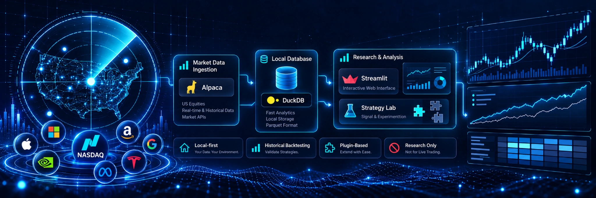
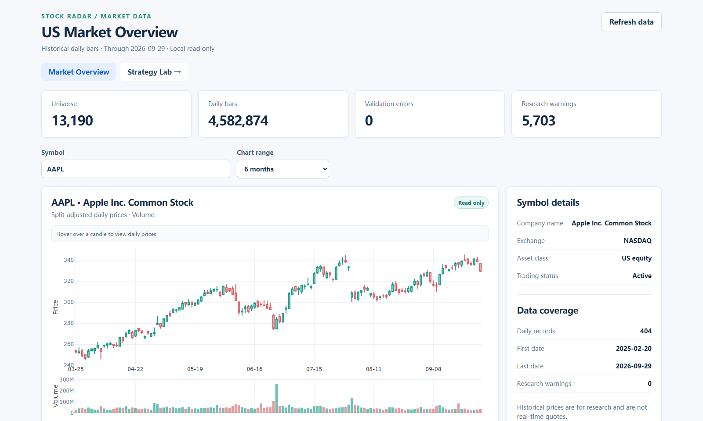
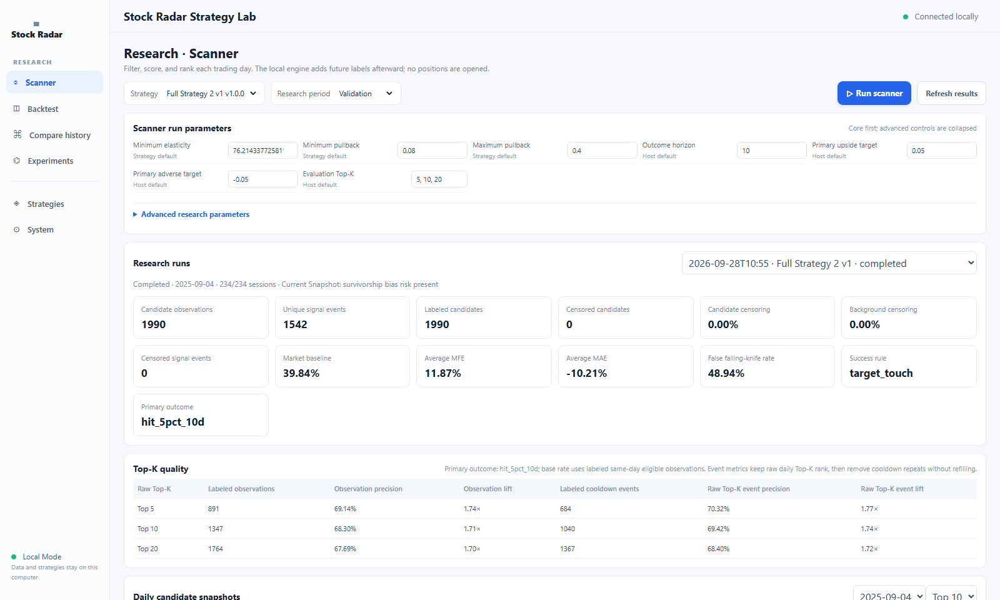
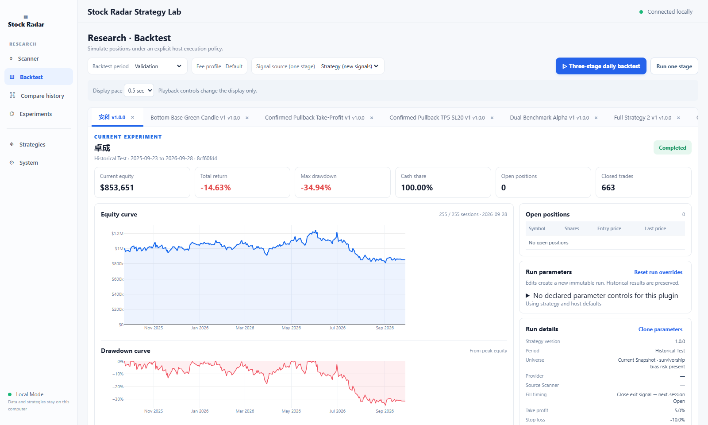
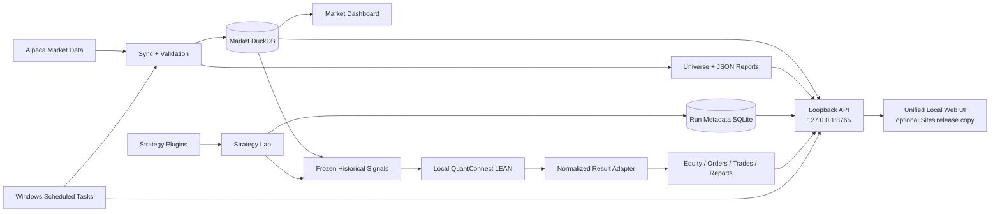

<p align="center">
  <strong>English</strong> · <a href="./README.zh-CN.md">简体中文</a>
</p>

<h1 align="center">📡 Stock Radar</h1>

<p align="center">
  
</p>

<p align="center">
  <strong>A local-first quantitative stock radar for turning discretionary trading ideas into measurable, testable candidate selection.</strong><br>
  Market data · pattern quantification · candidate ranking · historical validation · reproducible research
</p>

<p align="center">
  
  
  
  
  
  
</p>

<p align="center">
  <sub>Research-only · Local-first · Reproducible · No broker execution</sub>
</p>

> **2026-10-09 independent Draft:** Q2 `high-beta-liquid-channel-v1.2` adds hard SPY beta / SIP dollar-volume gates and repeated-channel / daily-readiness diagnostics. Real current-pool scan:226 market admissions,1 waiting candidate,0 early reversals.809 Native-inclusive tests pass. Blind human quality review and normal API reload remain pending; profitability is not established. Frozen Q1/Q2 v1.1 stay unchanged. [Guide](docs/Q2_HIGH_BETA_CHANNEL_V1_2.md) · [Actual acceptance](reports/acceptance/q2-v1.2-high-beta-channel-2026-10-09.md).

> [!IMPORTANT]
> Stock Radar is research software only. **Nothing in this repository places broker orders.** The project is being refocused from a general-purpose backtesting platform toward a personal quantitative stock-selection research system. The primary question is not how high a historical portfolio return can be, but whether subjective setup language can be translated into causal, reproducible market features that consistently enrich favorable forward outcomes. Existing backtest results do **not** establish a deployable trading edge; the previously viewed Test slice is exploratory rather than fresh out-of-sample evidence.

<p align="center">
  <a href="#overview">Overview</a> ·
  <a href="#interface-preview">Preview</a> ·
  <a href="#project-status">Status</a> ·
  <a href="#architecture">Architecture</a> ·
  <a href="#setup">Setup</a> ·
  <a href="#local-research-scanner-and-strategy-lab">Research Lab</a> ·
  <a href="#conventions-and-limitations">Limitations</a>
</p>

## Overview

### Q1/Q2 implementation candidate · 2026-10-09

Latest-session Quant watchlists are available in the existing local Scanner page on [implementation PR #13](https://github.com/zhoushuming073-cell/stock-radar/pull/13): independent Q1 fuzzy-shape-v1, hardened Q2 parallel-channel-v1.1 and overlap, with persistent snapshots and silent daily updates. [Daily guide](docs/DAILY_QUANT_SCANNER.md), [method contract](docs/Q1_Q2_QUANT_RESEARCH.md), [Native execution](docs/Q1_Q2_LEAN_METHODOLOGY.md).

**Release is pending local execution gates.** Source engineering, Native fixtures and the real Daily UI pass; bounded historical portfolio runs may be blocked by frozen execution data and must not be substituted with easier candidates. QC Cloud may run only after all mandatory local gates pass. These are exploratory vendor-price proxies, not formal raw PIT, full-split validation, Fresh OOS or a proven edge. [Actual acceptance](reports/acceptance/q1-q2-quant-infrastructure-backtest-2026-10-09.md), [machine evidence](reports/evidence/q1-q2-quant-infrastructure-backtest-2026-10-09.json), [Cloud boundary](docs/Q1_Q2_QC_CLOUD.md). No Vision/Fusion training was performed; the human trial remains paused.

**Current local database status · 2026-10-08:** Research Infrastructure v1 is **FROZEN**, Shape Research is READY, General PIT is Tier 1 (deep/audit). Broad database expansion is CLOSED; maintenance and local strategy/visual research continue. Supported safe candles: 5,407,961; technical readiness: 83.8733% of observed common member-days. Fresh decision lookback is corrected; formal frozen-strategy QC validation remains NOT_RUN. [Infrastructure and default API](docs/RESEARCH_INFRASTRUCTURE_V1.md), [47-answer finalization](reports/acceptance/research-infrastructure-v1-finalization-2026-10-08.md).

**Current stage · 2026-10-07:** research infrastructure and initial local LEAN
integration accepted; open-source historical PIT reconstruction and an independent
identity-bounded feature store added. PIT data remains exploratory and incomplete,
and the installed formal PIT portfolio remains blocked by specific Run dependencies. [Research-grade PIT acceptance](reports/acceptance/pit-research-grade-acceptance-2026-10-07.md), [bulk source benchmark](reports/acceptance/pit-source-breakthrough-acceptance-2026-10-07.md), [PIT data clearance](reports/acceptance/pit-clearance-acceptance-2026-10-07.md), [Final PIT execution acceptance](reports/acceptance/pit-final-acceptance-2026-10-07.md), [PIT acceptance](reports/acceptance/pit-acceptance-2026-10-07.md),
[reviewed identity / retired-price acceptance](reports/acceptance/pit-data-trust-acceptance-2026-10-07.md)
and [development report](reports/current/development-status-2026-10-06.md)
document what works, what is limited and what remains open.

### Shared Vision / human-label infrastructure · 2026-10-09

The dual-stage SVG / H_blind / H_review / Y_future subsystem has passed real local engineering acceptance (300 unique historical windows +30 repeats;728 tests including Native LEAN; real browser leakage checks). It is now treated as **shared research infrastructure**, not the sole project roadmap. The human trial is currently **paused**; no Vision training or alpha claim exists.

[Subsystem guide](docs/QUANT_VISION_DUAL_STAGE_LABELING_V3.md) · [Acceptance](reports/acceptance/quant-vision-dual-stage-v3-acceptance-2026-10-09.md).

### Local LEAN backtests

New web backtests use the independently installed, free open-source
**QuantConnect LEAN** execution engine. Stock Radar remains the sole strategy,
Scanner and stock-selection source; it exports frozen daily signals and adapts
LEAN results into the existing UI. Equity, drawdown, benchmark, trades, history
and Compare stay in the same website. Legacy results are labeled as archived;
the old execution engine is retained only for compatibility validation.
The previous UI is preserved at tag `legacy-backtest-ui-2026-10-06`.
See [setup, contracts, assumptions and verified migration](docs/LEAN_EXECUTION.md).

Stock Radar is a personal US-equity quantitative research system built around a practical workflow: reduce thousands of stocks to a small daily watchlist whose price structure matches a defined trading setup, then leave contextual judgment—news, catalysts, fundamentals, premarket behavior and other non-price information—to a later research stage.

The design remains deliberately **local-first**: Alpaca credentials, DuckDB market data, strategy plugins, run metadata, and detailed research artifacts stay on the machine running Stock Radar. The private browser dashboard talks only to a loopback API on that machine.

For source code, the web UI, configuration templates, and tracked documentation, GitHub `main` is the source of truth. Fetch and fast-forward from `origin/main` before new work, review any local changes, then publish verified changes back to `main`. The local website is served from `site/dist` in this repository. Market databases, run history, credentials, and generated exports under `data/` remain local and are never replaced by a source sync.

## Interface preview

These screenshots were captured from the local application on 2026-09-30, before
the LEAN-only launch change. They illustrate the retained layout, not current
engine acceptance. The figures are historical research data on one computer;
they are not live quotes or trading signals.

**Market overview** — daily candles, volume, data coverage, and validation status.



**Scanner research** — saved candidate quality, event metrics, and daily snapshots.



**Backtest research** — saved run settings, equity, drawdown, and positions.



## Research direction

The current authoritative roadmap is the [Research Master Guide](docs/RESEARCH_MASTER_GUIDE.md).

Stock Radar now has exactly **three top-level research families**:

| Family | Current subpaths |
| --- | --- |
| **Quant-only** | Q1 fuzzy-shape-v1; Q2 parallel-channel-v1 (Draft PR #10); later Q1/Q2 ensemble / classical ML |
| **Quant + Vision** | classical-ML Fusion; deep-learning Fusion |
| **Vision-only** | classical visual ML; deep-learning visual models |

Human blind labels, retrospective review, objective future outcomes, numeric OHLCV sequence models, LEAN/QC and GPT/news review are **shared supervision / control / validation layers**, not separate top-level roadmaps.

The project is still in **infrastructure + method-definition stage**. Existing historical Strategy 2 studies, Scanner forward statistics and LEAN smoke runs are engineering/exploratory evidence; there is **no formal current-strategy backtest or fresh OOS result proving Q1/Q2/Vision/Fusion alpha**.

Current method status:
- **Q1 fuzzy-shape-v1:** implemented and used for candidate generation, predictive efficacy not yet validated.
- **Q2 parallel-channel-v1:** experimental Draft PR #10, not merged; real-market validation and algorithm review still required.
- **Quant+Vision v3 subsystem:** engineering accepted but human trial paused; model training not started.
- **Vision-only / Fusion ML/DL:** formal experiments not started.

All future comparisons must use the same causal universe, decision time, split, outcome definition and execution assumptions. Complexity is kept only if it adds stable out-of-sample value over simpler baselines.

The long-term goal is not to reproduce a universal institutional trading stack. It is to build a reproducible **personal quantitative stock radar** that turns a discretionary selection process into something measurable, falsifiable and useful as the first stage of a human/GPT research workflow.
### What it includes

| Layer | Current implementation |
| --- | --- |
| **Phase 1 · Data foundation** | Asset master, split-adjusted daily OHLCV, incremental sync, validation, universe export, DuckDB provenance checks |
| **Historical Phase 2 · Compatibility** | Frozen baselines, initial Strategy 2 research and legacy accounting retained as historical evidence and migration validators |
| **Strategy research / Scanner** | Plugin v1, trusted ZIP import, causal daily candidate snapshots, forward outcomes, Precision/Lift, cooldown event metrics, filter funnels and regime breakdowns |
| **Formal Backtest execution** | Independent local QuantConnect LEAN, frozen signal/price exports, native portfolio execution, normalized results, golden-case reconciliation and engine/build audit |
| **Research workflow** | Persistent shared run queue, sequential stage timeline, curves/holdings/trades, history rename/archive/restore, Compare, bounded experiments and evidence export |
| **Web UI** | One maintained browser frontend for market data, Scanner, Backtest, strategies and experiments; local API on port 8765 |
| **Automation** | Windows scheduled market refresh and local API startup |
| **Execution boundary** | No broker-order path; research runs and dashboards do not place trades |

## Project status

**As of 2026-10-06: the research infrastructure is usable, and the first local
LEAN execution bridge has passed engineering acceptance.** New web Backtests,
sequential three-stage timelines and Backtest experiments use LEAN only.
Stock Radar continues to own all strategy selection and Scanner evaluation.
This is a daily-price research integration, not validated intraday execution or
evidence of a profitable strategy.

- [Detailed development-stage report (Chinese)](reports/current/development-status-2026-10-06.md)
- [Canonical status and remaining backlog](reports/journey-2026-09-30-0651-📌当前总账.md)
- [LEAN setup, signal/result contracts and execution assumptions](docs/LEAN_EXECUTION.md)
- [Archived legacy web version](https://github.com/zhoushuming073-cell/stock-radar/tree/legacy-backtest-ui-2026-10-06)

Engineering acceptance on 2026-10-06: **272 tests passed, 1 existing deprecation
warning**, including native LEAN golden cases. A real historical Scanner snapshot
completed a **245-session / 96-closed-trade** native smoke run; the existing UI
displayed its curves, holdings, trades and engine audit. These are local acceptance
results, not a new hosted-CI or Fresh OOS result. Detailed balances and raw results
remain local.

- [x] Asset master and eligible-universe export
- [x] Incremental Alpaca SIP daily-bar ingestion
- [x] DuckDB storage with provider/feed/adjustment provenance
- [x] Non-destructive market-data validation
- [x] Local Web market overview and research lab
- [x] Legacy backtest engine and frozen baseline retained for compatibility validation
- [x] LEAN-only web Backtests, normalized adapter, native parity cases and browser acceptance
- [x] Initial seven-stage Strategy 2 research candidate
- [x] Strategy plugin interface v1 and ZIP-ready template
- [x] Persistent local Strategy Lab and run queue
- [x] Parameter-grid, stage-ablation, and rolling walk-forward experiments
- [x] Private Sites integration and unattended local updates
- [x] Canonical run configuration, Scanner outcome labels, event counts, filter funnel, and local PIT import boundary
- [x] Blind chart snapshots and local Label Studio infrastructure (P0/P1 acceptance)
- [x] Secure dual-stage SVG / H_blind / H_review / Y_future engineering acceptance
- [x] Q1 fuzzy-shape-v1 candidate-generation implementation
- [ ] Validate / revise Q1 candidate quality under the new master comparison contract
- [ ] Complete real-market engineering and shape acceptance for Q2 parallel-channel-v1 (Draft PR #10)
- [ ] Build Quant-only Q1/Q2/Q3 comparable baselines
- [ ] Build Vision-only classical-ML and deep-learning baselines
- [ ] Build Quant+Vision classical-ML and deep-learning Fusion baselines
- [ ] Compare all three families on one causal universe / split / outcome / execution contract
- [ ] Freeze surviving methods before any formal held-out evaluation
- [ ] Accumulate genuinely new OOS evidence, then use LEAN/QC for execution validation
- [ ] Candidate-only intraday and GPT/news/fundamental review only after the daily selector is justified
- [ ] Broker execution / live trading — intentionally not implemented

## Architecture



The market database remains read-only to research workers. Strategy Lab stores reproducibility metadata separately in local SQLite WAL, and queued runs fail on source/data hash mismatches instead of silently executing changed inputs.

## Setup

Requires Python 3.11 or newer for Stock Radar. LEAN Backtests additionally require
the separate compiled local installation; Python package setup alone does not
install the engine. See [LEAN installation requirements](docs/LEAN_EXECUTION.md).
From the project root:

```powershell
python -m venv .venv
& .\.venv\Scripts\python.exe -m pip install -e ".[dev]"
Copy-Item .env.example .env
```

Then edit the untracked `.env` and fill in your Alpaca credentials:

```
ALPACA_API_KEY=...
ALPACA_SECRET_KEY=...
```

Credentials are read from the environment first, then from `.env` in the project
root (via `python-dotenv`). Both keys are required for `sync` and `validate`;
`init-db` needs neither. `.env` is gitignored — never commit keys.

## Configuration

`config/base.yaml` configures market ingestion; `config/research.yaml` defines
research splits, and `config/lean.yaml` configures the native Backtest installation:

```yaml
provider: alpaca
database_path: data/market.duckdb
daily_bars:
  feed: sip
  adjustment: split
  lookback_sessions: 400
```

- `feed: sip` — historical daily research uses Alpaca SIP. The feed is passed
  explicitly to every request; there is no automatic fallback to another feed.
- `adjustment: split` — split-adjusted daily bars.
- `lookback_sessions: 400` — number of market sessions (from the Alpaca calendar,
  not calendar days) covered by a default `sync` or `validate` run.
- `database_path` can be overridden by `RADAR_DB_PATH` (environment or `.env`).

## Commands

Run all commands from the project root; settings and `.env` resolve against the
current directory (`--project-root` overrides it).

```powershell
python -m radar init-db
python -m radar sync
python -m radar validate
```

- `init-db` — creates `data/market.duckdb` and applies schema version 1. Safe to
  re-run; existing rows are preserved.
- `sync` — refreshes the asset master and universe export, then downloads only the
  daily-bar sessions that are missing from the database and upserts them.
- `validate` — opens the database read-only, re-checks stored bars for the latest
  observed asset snapshot in the session window, and writes a JSON summary.

`sync` and `validate` both accept these bounded options for smoke runs:

| Option | Meaning |
| --- | --- |
| `--end YYYY-MM-DD` | Last session date to cover. Default: previous US/Eastern day. |
| `--lookback N` | Number of sessions, overriding `lookback_sessions`. |
| `--max-symbols N` | Limit to the first N eligible symbols (sorted by symbol). |

```powershell
python -m radar sync --end 2026-09-24 --lookback 5 --max-symbols 20
python -m radar validate --end 2026-09-24 --lookback 5 --max-symbols 20
```

Each command prints a one-line JSON result to stdout.

## Local data dashboard

On Windows, double-click `启动本地看板.cmd` in the project root. The launcher
starts or reuses the local Web UI at `http://127.0.0.1:4174` and the local API
at `http://127.0.0.1:8765`, then opens the Scanner page. Use **Market Overview**
to inspect universe and daily-bar counts, validation warnings, symbol coverage,
and historical OHLCV charts. The page reads local data and does not call Alpaca,
provide real-time quotes or place orders. **Sync from Alpaca** triggers the existing
silent scheduled update; the page shows its latest status and exchange coverage.
Run `sync` and `validate` first if the output files are missing, then refresh the
browser after they change. **System** shows read-only research defaults.

## Local Research Scanner and Strategy Lab

The Web UI at `http://127.0.0.1:4174/lab.html#scanner` is the single maintained
research interface. It uses the loopback API on port 8765 and shows the
three-stage trading-day timeline. The Market navigation link opens the data dashboard.
Local changes to `site/dist/` appear without a Sites
deployment; deploy Sites only when a release is ready.

Scanner Research is the primary workflow: it saves daily candidate rankings,
generic diagnostic scores, host-generated forward labels, configurable Precision/Lift
at Top-K, pooled and daily precision, target-before-adverse outcomes, unique
signal-event counts and event-level Precision/Lift, daily filter funnels, MFE/MAE
and market-regime breakdowns under the selected primary outcome without opening simulated
positions. Strategy Backtest uses local LEAN for portfolio diagnostics, with
per-strategy exits (including `null` to turn each automatic exit off).
New runs persist the resolved `strategy/evaluation/execution/dataset` configuration
and the source of each value. The browser uses an explicit core/advanced parameter
schema. [Research parameter contract](docs/RESEARCH_PARAMETER_CONTRACT.md) explains
the meaning and compatibility of these fields.
Experiments can run Scanner grids over strategy and evaluation parameters on
Train/Validation; the Test period remains outside parameter search.
The plugin interface stays at version 1; see
[the v1.5 scanner specification](docs/STRATEGY_PLUGIN_SPEC.md) for exact label
formulas, eligibility and reproducibility rules.

The Scanner and Strategy Lab are also available inside the existing Sites dashboard at
[`/lab.html`](https://stock-radar-local.zhoushuming.chatgpt.site/lab.html).
Local source changes are visible on port 4174; the hosted Sites copy changes only
after an explicit release deployment.
The Web UI imports trusted strategy ZIPs, queues backtests, shows live
equity/drawdown, and compares completed runs. Market data and run results remain
on this computer. Nothing in the Lab places broker orders.

The current `full_strategy2_v1` plugin is
installed under `strategies/`. A standalone authoring guide and ZIP-ready
example are in [the Strategy Plugin specification](docs/STRATEGY_PLUGIN_SPEC.md)
and `templates/strategy_plugin_template/`. Only import Python strategy code
from authors you trust: structural, AST and test checks are useful validation,
but they are not an operating-system sandbox.

Each run stores its configuration and reproducibility metadata in local SQLite
WAL at `data/strategy-lab/runs.sqlite3`, while workers read the market DuckDB
read-only. Completed Runs are immutable. The default is one shared local worker
for Backtest and Scanner; an explicit setting can raise the cap to four. The
shared queue runs the oldest eligible work first. Cancelling a Run
stops Scanner/compatibility work between sessions and terminates the native LEAN
child for a LEAN Run. A source/data hash mismatch fails the queued Run
instead of silently executing changed inputs.

Backtest and Scanner can use Fresh OOS after enough post-freeze trading sessions
arrive; the choice appears only when that interval exists. Historical Test stays
frozen and exploratory. Experiment parameter searches remain limited to Train
and Validation. Research-store promotion keeps the latest three complete
backups by default; `scripts/build_research.py --backup-retention N` changes
that limit for a build.

**Historical legacy-plugin migration evidence, separate from LEAN acceptance:**
the complete Phase 2 Strategy 2 migration was checked against the saved
Train, Validation and previously viewed Test artifacts: 1,231 signal dates and
all equity, order and trade CSV rows matched exactly. Recheck locally with:

```powershell
& .\.venv\Scripts\python.exe scripts/verify_phase3_plugin_parity.py
```

The Test slice was already viewed before Phase 3 and is exploratory. Do not
treat reruns or parameter comparisons on it as fresh out-of-sample evidence.
The open-source selection and license notes are in
[the Phase 3 audit](docs/phase3-open-source-audit.md).

The experiment panel can queue bounded parameter grids (at most 64 variants),
full Strategy 2 stage ablations (baseline plus eight omissions), and rolling
walk-forward folds. Experiments use Train/Validation history only and save each
variant as an independent Run. Walk-forward currently holds parameters fixed
across folds; it reports OOS distribution rather than fitting parameters in
each fold. This avoids a misleading optimization claim.

## Private Sites dashboard and unattended updates

The private [Sites dashboard](https://stock-radar-local.zhoushuming.chatgpt.site)
hosts only HTML, CSS and JavaScript. It reads market data and controls local
research Runs through the loopback `127.0.0.1:8765` API on **this computer**.
The dashboard's market endpoints remain read-only; Strategy Lab endpoints can
queue Runs and import a user-selected plugin ZIP only for the configured Site
origin. DuckDB, Run results, plugin files and Alpaca credentials stay local.
After signing in to the Site, allow its browser
prompt to access the local computer if one appears. Other computers cannot read
this computer's loopback API.

Two Windows tasks are installed for the current user:

| Task | When | Purpose |
| --- | --- | --- |
| `StockRadar-DailyUpdate` | Tuesday–Saturday at 08:30 China time, and at next logon | Update the most recent completed US trading day, backfill missing sessions, then validate. An already successful target date is skipped. |
| `StockRadar-LocalApi` | At logon | Serve the local dashboard and Strategy Lab API on `127.0.0.1:8765`. |

Both use `pythonw.exe` and run without a console window. A missed update while
the computer is off runs after the next logon; the computer must be online to
reach Alpaca. The database remains in `data/market.duckdb`; the latest job
result is in `data/daily-update-status.json`. No market data is uploaded to
Sites by this setup.

To inspect or run the update manually:

```powershell
Get-ScheduledTaskInfo -TaskName StockRadar-DailyUpdate
Get-Content data/daily-update-status.json
Start-ScheduledTask -TaskName StockRadar-DailyUpdate
```

The scheduled run reads Alpaca keys from `.env` when present, otherwise from
`../alpacakey.txt` on this machine. Reinstall the tasks after moving the project
or changing the Site address:

```powershell
& ./scripts/install-automation.ps1 -SiteOrigin 'https://stock-radar-local.zhoushuming.chatgpt.site'
```

## Phase 2 simplified-baseline historical backtest

> Archived legacy-engine research. The commands and returns below reproduce old
> evidence; they are not the current formal web Backtest path or LEAN results.

Phase 2 research uses local SIP, split-adjusted daily bars in
`data/phase2-research.duckdb`. The research database and detailed trade files
stay on this computer and are gitignored. The rules and split definitions are
in `config/research.yaml`, `config/backtest.yaml`, and the final one-time Test
freeze in `config/frozen_backtest_v1.yaml`.

The frozen combined-rank baseline returned **-81.14% Train**, **+4.49%
Validation**, and **-55.10% final Test** after modeled fees and slippage. The
Test portfolio fell from $1,000,000 to $448,957.69. See
[`reports/phase2/backtest_final.md`](reports/phase2/backtest_final.md) for the
full accounting, benchmark, verification, and limitations. The local interactive
chart is `data/research/final-test-v1/回测报告.html` after the run.

With the local research database already prepared, the reproducible commands are:

```powershell
& .\.venv\Scripts\python.exe scripts/run_backtest_research.py
& .\.venv\Scripts\python.exe scripts/run_frozen_backtest.py
& .\.venv\Scripts\python.exe scripts/verify_final_backtest.py
& .\.venv\Scripts\python.exe scripts/render_backtest_report.py
```

The tested candidate ranks high Elasticity and deep 20-session drawdowns. It
does not yet require prior strength, downside exhaustion, support/absorption,
absence of new lows, and early bullish confirmation together. Its result must
not be presented as the full Strategy 2 return.

The baseline's final Test runner records a one-time evaluation marker and
returns the stored result on a repeat invocation.

## Full Strategy 2 exploratory research

> Historical legacy-engine results; retained for research provenance. New web
> runs use LEAN. These historical returns do not describe native LEAN acceptance.

The first seven-stage candidate includes prior strength, pullback, downside
exhaustion, support/absorption, stopped new lows, early reversal, and an
extension limit. The exact feature mapping and provisional thresholds are in
[`reports/phase2/full_strategy2_feature_map.md`](reports/phase2/full_strategy2_feature_map.md).
At 10 bps slippage per side plus illustrative fees, it returned **-36.83%
Train**, **+29.11% Validation**, and **+10.75% on the previously viewed
historical Test**. Results and cost sensitivity are in
[`reports/phase2/full_strategy2_backtest.md`](reports/phase2/full_strategy2_backtest.md).
That Test result is exploratory because its dates were already viewed for the
baseline; it is not fresh out-of-sample evidence.

```powershell
& .\.venv\Scripts\python.exe scripts/run_full_strategy2_backtest.py --splits train validation
& .\.venv\Scripts\python.exe scripts/run_full_strategy2_backtest.py --splits test
& .\.venv\Scripts\python.exe scripts/verify_full_strategy2_backtest.py
& .\.venv\Scripts\python.exe scripts/print_full_strategy2_summary.py
& .\.venv\Scripts\python.exe scripts/render_full_strategy2_report.py
```

Detailed ledgers, scenario summaries, and verification stay in the gitignored
`data/research/full-strategy2-v1/` directory. The self-contained local chart is
`data/research/full-strategy2-v1/策略2完整条件回测.html`. A new untouched period is needed
to validate any claimed improvement. This remains research, not an order signal.

## Outputs

| Path | Contents |
| --- | --- |
| `data/market.duckdb` | DuckDB database: `assets` (asset master) and `daily_bars` (OHLCV + provider/feed/adjustment provenance), plus `schema_migrations`. |
| `data/universe.csv` | Eligible universe, sorted by symbol, columns: `symbol, name, exchange, asset_class, tradable, fractionable, shortable`. |
| `data/validation-summary.json` | Latest `validate` report: checked/accepted/rejected rows and structured issues. |
| `data/ingestion-issues.json` | Latest `sync` report: failed symbols and detailed data issues. |
| `data/daily-update-status.json` | Latest silent market-update status. |
| `data/phase2-research.duckdb` | Separately built causal research features and labels; not refreshed by the market daily task. |
| `data/strategy-lab/runs.sqlite3` | Local Run/Scanner metadata, daily snapshots, results and presentation state. |
| `data/strategy-lab/lean/<run_id>/` | Sealed signals/prices/manifest, native output and `normalized-result.json`. |

Generated files under `data/` are gitignored.

## Conventions and limitations

- **LEAN bridge scope:** daily Open/Close proxies, immediate settlement,
  next-session execution, configured fees/slippage and native portfolio accounting.
  No real minute path, order-book depth or partial fills. Current illustrative fees
  are unconfirmed; PIT execution uses a frozen run dependency gate; unresolved required prices, identities or actions block that Run.
- **Market refresh and research refresh are separate.** The silent daily task
  updates `market.duckdb` and validation reports. It does not automatically merge
  new bars into `phase2-research.duckdb`, rebuild its features, or rerun Scanner.
  Research rebuild/promotion is a separate explicit operation.
- **Daily-use Scanner is still pending.** Historical per-session snapshots exist;
  a dedicated one-click latest-session watchlist is not yet implemented.
- **Remaining correctness work is tracked explicitly.** Scanner horizon boundaries,
  source-Scanner implementation provenance and batch snapshot consistency remain
  open in the [canonical backlog](reports/journey-2026-09-30-0651-📌当前总账.md).

- **Asset master comes from current snapshots.** Only active US-equity assets are
  requested from Alpaca, so tickers that were delisted or renamed before the first
  `sync` never enter the database. Historical research over 400 sessions therefore
  carries **survivor bias**; it is not a point-in-time universe.
  Previously observed assets remain in the master with an older `last_seen`;
  `validate` uses only the newest observed snapshot.
- **PIT mode needs external historical evidence.** The local CSV + manifest adapter
  accepts a dated security master with stable security IDs and checks interval
  coverage. The historical Git snapshot builder and separate identity-bounded
  features support exploratory reconstruction; generated data stays local and
  is incomplete. A current Alpaca snapshot cannot make old studies bias-free.
  See [PIT build/import workflow](docs/PIT_SECURITY_MASTER.md).
- **The eligible filter is coarse, not common-stock-only.** It keeps US-equity
  assets that are `active` and `tradable` and listed on NASDAQ, NYSE, AMEX, ARCA
  or BATS. ETFs, ADRs, preferred shares and similar listed equity-like classes pass
  the filter. OTC and non-major venues are excluded.
- **No feed fallback.** If SIP is rejected (e.g. HTTP 401/403), the run fails with
  a provider error instead of silently switching to another feed.
- **Provenance is strict.** Bars carry `provider`, `feed` and `adjustment`, and a
  row may be replaced only by a newer download with the same triple. Writing into
  the same database with a conflicting provider/feed/adjustment raises an error
  rather than mixing series.
- **Zero-volume bars keep nullable VWAP.** Alpaca can report `vwap = 0` with zero
  trades; that is mathematically undefined, so `NULL` is stored instead of
  rejecting an otherwise valid bar.
- **Missing sessions are retried, not skipped.** Ingestion re-requests any session
  window with no stored bars on every run, so a halted or newly listed ticker whose
  bars do not exist yet is requested again on the next `sync`.
- **Large price jumps warn, they do not reject.** A close-to-close move beyond the
  jump threshold is recorded as a `warning` (code `abnormal_price_jump`) because
  splits and other corporate actions can legitimately cause it. Review these
  manually.
- **No corporate-action reconciliation.** There is no automated handling of
  splits, mergers, or ticker changes beyond the provider's split adjustment.
- **Validation is non-destructive.** It reads stored bars and flags gaps, missing
  sessions, stale tickers and malformed rows; it does not delete or repair data.

## Research-grade PIT

Research-grade readiness is separate from the retained strict vendor-grade gate.
Frozen rules automatically accept 2,597 stable identities; an independent raw
price dataset accepts 906,095 rows, including 66,236 recovered missing rows.
Historical Core membership uses prior-session liquidity and a cap of 1,000;
52–111 unknown competitors per day remain visible rather than being excluded
because their data is missing. Production Scanner diagnostics compare A/B/C
with the same Strategy 2 parameters and window.

`GET /api/lab/pit-research-readiness` and the System card expose the explicit
**Research-Grade PIT** label and frozen evidence. Native execution requires
explicit research-grade inputs and passing gates; it cannot fall back to Current
Snapshot. Real Validation Native execution remains blocked by unresolved
identity, material events, prices and membership uncertainty. Scanner diagnostics
and passing native fixtures do not establish a trustworthy PIT portfolio result.
The existing local API process needs a normal reload to serve the new route.
See the [acceptance and scope counts](reports/acceptance/pit-research-grade-acceptance-2026-10-07.md)
and [derived evidence](reports/evidence/pit-research-grade-evidence-2026-10-07.json).

The final decision audit narrows the scope to Core competitors, actual candidates
and possible holdings. Identity-safe bounds retain 29–72 possible competitors
per day; Full/Core daily Top3 overlap is 19.9115%. Core candidates still have
106 unresolved identities, 12 execution dates and 10 event/price review targets,
after accepting ten independently checked SMR holding-only rows. Real PIT Native
remains blocked; identical C/D lists do not prove robustness. See the
[20-answer final acceptance](reports/acceptance/pit-research-final-acceptance-2026-10-07.md)
and [focused P0 queue](reports/evidence/pit-research-final-priority-2026-10-07.json).
The new decision gate is an independent CLI audit; the existing API and Native
release route retain their frozen blocked evidence.

## Tests

Portable tests use temporary DuckDB databases and fake providers; they do not
contact Alpaca or read real credentials. Native LEAN installation tests are
skipped unless explicitly enabled. For the native acceptance suite, with the
independent installation available:

```powershell
$env:STOCK_RADAR_TEST_LEAN = '1'
& .\.venv\Scripts\python.exe -m pytest -q
Remove-Item Env:STOCK_RADAR_TEST_LEAN
```

The latest recorded native-inclusive acceptance is 468 passed on 2026-10-07,
including 32 new decision-scope cases. Real-engine fixture reconciliation passed;
the real Strategy 2 Research PIT portfolio remains NOT_RUN.
For the portable suite:

```powershell
& .\.venv\Scripts\python.exe -m pytest
```

`pyproject.toml` sets `testpaths = ["tests"]` and `pythonpath = ["src"]`, so a bare
`pytest` from the project root works too.
