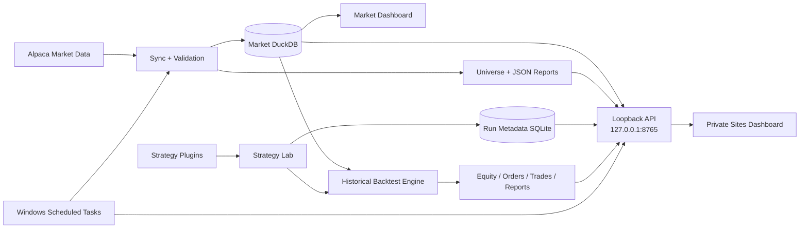

<p align="center">
  <strong>English</strong> · <a href="./README.zh-CN.md">简体中文</a>
</p>

<h1 align="center">📡 Stock Radar</h1>

<p align="center">
  
</p>

<p align="center">
  <strong>A local-first quantitative stock radar for turning discretionary trading ideas into measurable, testable candidate selection.</strong><br>
  Market data · pattern quantification · candidate ranking · historical validation · reproducible research
</p>

<p align="center">
  
  
  
  
  
  
</p>

<p align="center">
  <sub>Research-only · Local-first · Reproducible · No broker execution</sub>
</p>

> [!IMPORTANT]
> Stock Radar is research software only. **Nothing in this repository places broker orders.** The project is being refocused from a general-purpose backtesting platform toward a personal quantitative stock-selection research system. The primary question is not how high a historical portfolio return can be, but whether subjective setup language can be translated into causal, reproducible market features that consistently enrich favorable forward outcomes. Existing backtest results do **not** establish a deployable trading edge; the previously viewed Test slice is exploratory rather than fresh out-of-sample evidence.

<p align="center">
  <a href="#overview">Overview</a> ·
  <a href="#project-status">Status</a> ·
  <a href="#architecture">Architecture</a> ·
  <a href="#setup">Setup</a> ·
  <a href="#local-research-scanner-and-strategy-lab">Research Lab</a> ·
  <a href="#conventions-and-limitations">Limitations</a>
</p>

## Overview

Stock Radar is a personal US-equity quantitative research system built around a practical workflow: reduce thousands of stocks to a small daily watchlist whose price structure matches a defined trading setup, then leave contextual judgment—news, catalysts, fundamentals, premarket behavior and other non-price information—to a later research stage.

The design remains deliberately **local-first**: Alpaca credentials, DuckDB market data, strategy plugins, run metadata, and detailed research artifacts stay on the machine running Stock Radar. The private browser dashboard talks only to a loopback API on that machine.

## Research direction

Stock Radar is being refocused around **pattern quantification** rather than maximizing a historical equity curve.

The practical workflow is:

```text
Full US-equity universe
→ causal quantitative screening
→ a small ranked candidate list
→ later GPT-assisted review of news, catalysts, fundamentals and premarket context
→ optional intraday confirmation
```

The research questions are now:

1. Can discretionary chart language such as *strong before the pullback, fell hard, stopped deteriorating, showed support, and may be ready for upside expansion* be translated into measurable features?
2. Does the quantitative scanner actually retrieve the kinds of charts a human would label as matching that setup?
3. Are those candidates enriched for favorable forward outcomes over a fixed horizon, even before any news or fundamental filter is applied?
4. Does a later contextual review add incremental value over the quantitative candidate list alone?

Backtesting therefore remains important, but increasingly as a **validation instrument**. The next research phase will emphasize candidate-quality metrics such as:

- Precision@5 / Precision@10 / Precision@20
- Lift@K versus the eligible-market base rate
- calibrated probability of reaching +3%, +5%, +8% or +10% within a fixed horizon
- forward MFE / MAE and time-to-target
- false falling-knife / post-signal new-low rate
- stability across years, bull/bear regimes and volatility environments

Planned research branches:

- **Quant** — structured features, interpretable pattern scores and probability models.
- **Vision** — a separate future path using standardized candlestick/volume images to test whether visual representations capture structure missed by hand-crafted features.
- **Fusion** — compare Quant-only, Vision-only and agreement between the two.
- **Intraday** — candidate-only minute data for support, reversal and execution-confirmation research rather than full-market minute data as the starting point.

The long-term goal is not to reproduce a universal institutional trading stack. It is to build a reproducible **personal quantitative stock radar** that turns a discretionary selection process into something measurable, falsifiable and useful as the first stage of a human/GPT research workflow.
### What it includes

| Layer | Current implementation |
| --- | --- |
| **Phase 1 · Data foundation** | Asset master, split-adjusted daily OHLCV, incremental sync, validation, universe export, DuckDB provenance checks |
| **Phase 2 · Research engine** | Historical backtest engine, frozen simplified baseline, initial seven-stage Strategy 2 candidate, verification and local reports |
| **Phase 3 · Strategy Lab** | Plugin interface v1, trusted ZIP import, persistent run queue, live equity/drawdown, run comparison, parameter grids, ablations and walk-forward folds |
| **Web UI** | One maintained browser frontend for market data, Scanner, Backtest, strategies and experiments; local API on port 8765 |
| **Automation** | Windows scheduled market refresh and local API startup |
| **Execution boundary** | No broker-order path; research runs and dashboards do not place trades |

## Project status

- [x] Asset master and eligible-universe export
- [x] Incremental Alpaca SIP daily-bar ingestion
- [x] DuckDB storage with provider/feed/adjustment provenance
- [x] Non-destructive market-data validation
- [x] Local Web market overview and research lab
- [x] Historical backtest engine and frozen baseline
- [x] Initial seven-stage Strategy 2 research candidate
- [x] Strategy plugin interface v1 and ZIP-ready template
- [x] Persistent local Strategy Lab and run queue
- [x] Parameter-grid, stage-ablation, and rolling walk-forward experiments
- [x] Private Sites integration and unattended local updates
- [x] Canonical run configuration, Scanner outcome labels, event counts, filter funnel, and local PIT import boundary
- [ ] Human-labelled chart-snapshot dataset for pattern ground truth
- [ ] Pattern-match evaluation with Precision@K / Recall / Lift@K
- [ ] Fixed-horizon target-hit probability research and calibration
- [ ] Market-regime conditioning
- [ ] Candidate-only intraday data for support / reversal / execution studies
- [ ] Quant vs Vision vs Fusion research branch
- [ ] Point-in-time candidate/context log for future GPT-assisted second-stage review
- [ ] Fresh untouched out-of-sample period for validating claimed strategy improvement
- [ ] Broker execution / live trading — intentionally not implemented

## Architecture



The market database remains read-only to research workers. Strategy Lab stores reproducibility metadata separately in local SQLite WAL, and queued runs fail on source/data hash mismatches instead of silently executing changed inputs.

## Setup

Requires Python 3.11 or newer. From the project root:

```powershell
python -m venv .venv
& .\.venv\Scripts\python.exe -m pip install -e ".[dev]"
Copy-Item .env.example .env
```

Then edit the untracked `.env` and fill in your Alpaca credentials:

```
ALPACA_API_KEY=...
ALPACA_SECRET_KEY=...
```

Credentials are read from the environment first, then from `.env` in the project
root (via `python-dotenv`). Both keys are required for `sync` and `validate`;
`init-db` needs neither. `.env` is gitignored — never commit keys.

## Configuration

`config/base.yaml` drives every run:

```yaml
provider: alpaca
database_path: data/market.duckdb
daily_bars:
  feed: sip
  adjustment: split
  lookback_sessions: 400
```

- `feed: sip` — historical daily research uses Alpaca SIP. The feed is passed
  explicitly to every request; there is no automatic fallback to another feed.
- `adjustment: split` — split-adjusted daily bars.
- `lookback_sessions: 400` — number of market sessions (from the Alpaca calendar,
  not calendar days) covered by a default `sync` or `validate` run.
- `database_path` can be overridden by `RADAR_DB_PATH` (environment or `.env`).

## Commands

Run all commands from the project root; settings and `.env` resolve against the
current directory (`--project-root` overrides it).

```powershell
python -m radar init-db
python -m radar sync
python -m radar validate
```

- `init-db` — creates `data/market.duckdb` and applies schema version 1. Safe to
  re-run; existing rows are preserved.
- `sync` — refreshes the asset master and universe export, then downloads only the
  daily-bar sessions that are missing from the database and upserts them.
- `validate` — opens the database read-only, re-checks stored bars for the latest
  observed asset snapshot in the session window, and writes a JSON summary.

`sync` and `validate` both accept these bounded options for smoke runs:

| Option | Meaning |
| --- | --- |
| `--end YYYY-MM-DD` | Last session date to cover. Default: previous US/Eastern day. |
| `--lookback N` | Number of sessions, overriding `lookback_sessions`. |
| `--max-symbols N` | Limit to the first N eligible symbols (sorted by symbol). |

```powershell
python -m radar sync --end 2026-09-24 --lookback 5 --max-symbols 20
python -m radar validate --end 2026-09-24 --lookback 5 --max-symbols 20
```

Each command prints a one-line JSON result to stdout.

## Local data dashboard

On Windows, double-click `启动本地看板.cmd` in the project root. The launcher
starts or reuses the local Web UI at `http://127.0.0.1:4174` and the local API
at `http://127.0.0.1:8765`, then opens the Scanner page. Use **Market Overview**
to inspect universe and daily-bar counts, validation warnings, symbol coverage,
and historical OHLCV charts. The page reads local data and does not call Alpaca,
provide real-time quotes or place orders. **Sync from Alpaca** triggers the existing
silent scheduled update; the page shows its latest status and exchange coverage.
Run `sync` and `validate` first if the output files are missing, then refresh the
browser after they change. **System** shows read-only research defaults.

## Local Research Scanner and Strategy Lab

The Web UI at `http://127.0.0.1:4174/lab.html#scanner` is the single maintained
research interface. It uses the loopback API on port 8765 and shows the
three-stage trading-day timeline. The Market navigation link opens the data dashboard.
Local changes to `site/dist/` appear without a Sites
deployment; deploy Sites only when a release is ready.

Scanner Research is the primary workflow: it saves daily candidate rankings,
generic diagnostic scores, host-generated forward labels, configurable Precision/Lift
at Top-K, pooled and daily precision, target-before-adverse outcomes, unique
signal-event counts and event-level Precision/Lift, daily filter funnels, MFE/MAE
and market-regime breakdowns under the selected primary outcome without opening simulated
positions. Strategy Backtest remains available for portfolio diagnostics, with
per-strategy exits (including `null` to turn each automatic exit off).
New runs persist the resolved `strategy/evaluation/execution/dataset` configuration
and the source of each value. The browser uses an explicit core/advanced parameter
schema. [Research parameter contract](docs/RESEARCH_PARAMETER_CONTRACT.md) explains
the meaning and compatibility of these fields.
Experiments can run Scanner grids over strategy and evaluation parameters on
Train/Validation; the Test period remains outside parameter search.
The plugin interface stays at version 1; see
[the v1.5 scanner specification](docs/STRATEGY_PLUGIN_SPEC.md) for exact label
formulas, eligibility and reproducibility rules.

The Scanner and Strategy Lab are also available inside the existing Sites dashboard at
[`/lab.html`](https://stock-radar-local.zhoushuming.chatgpt.site/lab.html).
Local source changes are visible on port 4174; the hosted Sites copy changes only
after an explicit release deployment.
The Web UI imports trusted strategy ZIPs, queues backtests, shows live
equity/drawdown, and compares completed runs. Market data and run results remain
on this computer. Nothing in the Lab places broker orders.

The current `full_strategy2_v1` plugin is
installed under `strategies/`. A standalone authoring guide and ZIP-ready
example are in [the Strategy Plugin specification](docs/STRATEGY_PLUGIN_SPEC.md)
and `templates/strategy_plugin_template/`. Only import Python strategy code
from authors you trust: structural, AST and test checks are useful validation,
but they are not an operating-system sandbox.

Each run stores its configuration and reproducibility metadata in local SQLite
WAL at `data/strategy-lab/runs.sqlite3`, while workers read the market DuckDB
read-only. Completed Runs are immutable. The default is one shared local worker
for Backtest and Scanner; an explicit setting can raise the cap to four. The
shared queue runs the oldest eligible work first. Cancelling a Run
stops it between sessions. A source/data hash mismatch fails the queued Run
instead of silently executing changed inputs.

Backtest and Scanner can use Fresh OOS after enough post-freeze trading sessions
arrive; the choice appears only when that interval exists. Historical Test stays
frozen and exploratory. Experiment parameter searches remain limited to Train
and Validation. Research-store promotion keeps the latest three complete
backups by default; `scripts/build_research.py --backup-retention N` changes
that limit for a build.

The complete Phase 2 Strategy 2 migration was checked against the saved
Train, Validation and previously viewed Test artifacts: 1,231 signal dates and
all equity, order and trade CSV rows matched exactly. Recheck locally with:

```powershell
& .\.venv\Scripts\python.exe scripts/verify_phase3_plugin_parity.py
```

The Test slice was already viewed before Phase 3 and is exploratory. Do not
treat reruns or parameter comparisons on it as fresh out-of-sample evidence.
The open-source selection and license notes are in
[the Phase 3 audit](docs/phase3-open-source-audit.md).

The experiment panel can queue bounded parameter grids (at most 64 variants),
full Strategy 2 stage ablations (baseline plus eight omissions), and rolling
walk-forward folds. Experiments use Train/Validation history only and save each
variant as an independent Run. Walk-forward currently holds parameters fixed
across folds; it reports OOS distribution rather than fitting parameters in
each fold. This avoids a misleading optimization claim.

## Private Sites dashboard and unattended updates

The private [Sites dashboard](https://stock-radar-local.zhoushuming.chatgpt.site)
hosts only HTML, CSS and JavaScript. It reads market data and controls local
research Runs through the loopback `127.0.0.1:8765` API on **this computer**.
The dashboard's market endpoints remain read-only; Strategy Lab endpoints can
queue Runs and import a user-selected plugin ZIP only for the configured Site
origin. DuckDB, Run results, plugin files and Alpaca credentials stay local.
After signing in to the Site, allow its browser
prompt to access the local computer if one appears. Other computers cannot read
this computer's loopback API.

Two Windows tasks are installed for the current user:

| Task | When | Purpose |
| --- | --- | --- |
| `StockRadar-DailyUpdate` | Tuesday–Saturday at 08:30 China time, and at next logon | Update the most recent completed US trading day, backfill missing sessions, then validate. An already successful target date is skipped. |
| `StockRadar-LocalApi` | At logon | Serve the local dashboard and Strategy Lab API on `127.0.0.1:8765`. |

Both use `pythonw.exe` and run without a console window. A missed update while
the computer is off runs after the next logon; the computer must be online to
reach Alpaca. The database remains in `data/market.duckdb`; the latest job
result is in `data/daily-update-status.json`. No market data is uploaded to
Sites by this setup.

To inspect or run the update manually:

```powershell
Get-ScheduledTaskInfo -TaskName StockRadar-DailyUpdate
Get-Content data/daily-update-status.json
Start-ScheduledTask -TaskName StockRadar-DailyUpdate
```

The scheduled run reads Alpaca keys from `.env` when present, otherwise from
`../alpacakey.txt` on this machine. Reinstall the tasks after moving the project
or changing the Site address:

```powershell
& ./scripts/install-automation.ps1 -SiteOrigin 'https://stock-radar-local.zhoushuming.chatgpt.site'
```

## Phase 2 simplified-baseline historical backtest

Phase 2 research uses local SIP, split-adjusted daily bars in
`data/phase2-research.duckdb`. The research database and detailed trade files
stay on this computer and are gitignored. The rules and split definitions are
in `config/research.yaml`, `config/backtest.yaml`, and the final one-time Test
freeze in `config/frozen_backtest_v1.yaml`.

The frozen combined-rank baseline returned **-81.14% Train**, **+4.49%
Validation**, and **-55.10% final Test** after modeled fees and slippage. The
Test portfolio fell from $1,000,000 to $448,957.69. See
[`reports/phase2/backtest_final.md`](reports/phase2/backtest_final.md) for the
full accounting, benchmark, verification, and limitations. The local interactive
chart is `data/research/final-test-v1/回测报告.html` after the run.

With the local research database already prepared, the reproducible commands are:

```powershell
& .\.venv\Scripts\python.exe scripts/run_backtest_research.py
& .\.venv\Scripts\python.exe scripts/run_frozen_backtest.py
& .\.venv\Scripts\python.exe scripts/verify_final_backtest.py
& .\.venv\Scripts\python.exe scripts/render_backtest_report.py
```

The tested candidate ranks high Elasticity and deep 20-session drawdowns. It
does not yet require prior strength, downside exhaustion, support/absorption,
absence of new lows, and early bullish confirmation together. Its result must
not be presented as the full Strategy 2 return.

The baseline's final Test runner records a one-time evaluation marker and
returns the stored result on a repeat invocation.

## Full Strategy 2 exploratory research

The first seven-stage candidate includes prior strength, pullback, downside
exhaustion, support/absorption, stopped new lows, early reversal, and an
extension limit. The exact feature mapping and provisional thresholds are in
[`reports/phase2/full_strategy2_feature_map.md`](reports/phase2/full_strategy2_feature_map.md).
At 10 bps slippage per side plus illustrative fees, it returned **-36.83%
Train**, **+29.11% Validation**, and **+10.75% on the previously viewed
historical Test**. Results and cost sensitivity are in
[`reports/phase2/full_strategy2_backtest.md`](reports/phase2/full_strategy2_backtest.md).
That Test result is exploratory because its dates were already viewed for the
baseline; it is not fresh out-of-sample evidence.

```powershell
& .\.venv\Scripts\python.exe scripts/run_full_strategy2_backtest.py --splits train validation
& .\.venv\Scripts\python.exe scripts/run_full_strategy2_backtest.py --splits test
& .\.venv\Scripts\python.exe scripts/verify_full_strategy2_backtest.py
& .\.venv\Scripts\python.exe scripts/print_full_strategy2_summary.py
& .\.venv\Scripts\python.exe scripts/render_full_strategy2_report.py
```

Detailed ledgers, scenario summaries, and verification stay in the gitignored
`data/research/full-strategy2-v1/` directory. The self-contained local chart is
`data/research/full-strategy2-v1/策略2完整条件回测.html`. A new untouched period is needed
to validate any claimed improvement. This remains research, not an order signal.

## Outputs

| Path | Contents |
| --- | --- |
| `data/market.duckdb` | DuckDB database: `assets` (asset master) and `daily_bars` (OHLCV + provider/feed/adjustment provenance), plus `schema_migrations`. |
| `data/universe.csv` | Eligible universe, sorted by symbol, columns: `symbol, name, exchange, asset_class, tradable, fractionable, shortable`. |
| `data/validation-summary.json` | Latest `validate` report: checked/accepted/rejected rows and structured issues. |
| `data/ingestion-issues.json` | Latest `sync` report: failed symbols and detailed data issues. |

Generated files under `data/` are gitignored.

## Conventions and limitations

- **Asset master comes from current snapshots.** Only active US-equity assets are
  requested from Alpaca, so tickers that were delisted or renamed before the first
  `sync` never enter the database. Historical research over 400 sessions therefore
  carries **survivor bias**; it is not a point-in-time universe.
  Previously observed assets remain in the master with an older `last_seen`;
  `validate` uses only the newest observed snapshot.
- **PIT mode needs external historical evidence.** The local CSV + manifest adapter
  accepts a dated security master with stable security IDs and checks interval
  coverage. No real historical security master is bundled, and a current Alpaca
  snapshot cannot make old studies bias-free. See [PIT import format](docs/PIT_SECURITY_MASTER.md).
- **The eligible filter is coarse, not common-stock-only.** It keeps US-equity
  assets that are `active` and `tradable` and listed on NASDAQ, NYSE, AMEX, ARCA
  or BATS. ETFs, ADRs, preferred shares and similar listed equity-like classes pass
  the filter. OTC and non-major venues are excluded.
- **No feed fallback.** If SIP is rejected (e.g. HTTP 401/403), the run fails with
  a provider error instead of silently switching to another feed.
- **Provenance is strict.** Bars carry `provider`, `feed` and `adjustment`, and a
  row may be replaced only by a newer download with the same triple. Writing into
  the same database with a conflicting provider/feed/adjustment raises an error
  rather than mixing series.
- **Zero-volume bars keep nullable VWAP.** Alpaca can report `vwap = 0` with zero
  trades; that is mathematically undefined, so `NULL` is stored instead of
  rejecting an otherwise valid bar.
- **Missing sessions are retried, not skipped.** Ingestion re-requests any session
  window with no stored bars on every run, so a halted or newly listed ticker whose
  bars do not exist yet is requested again on the next `sync`.
- **Large price jumps warn, they do not reject.** A close-to-close move beyond the
  jump threshold is recorded as a `warning` (code `abnormal_price_jump`) because
  splits and other corporate actions can legitimately cause it. Review these
  manually.
- **No corporate-action reconciliation.** There is no automated handling of
  splits, mergers, or ticker changes beyond the provider's split adjustment.
- **Validation is non-destructive.** It reads stored bars and flags gaps, missing
  sessions, stale tickers and malformed rows; it does not delete or repair data.

## Tests

The test suite is fully offline: it uses in-memory/temporary DuckDB databases and
fake provider objects, and it never contacts Alpaca or reads real credentials.

```powershell
& .\.venv\Scripts\python.exe -m pytest
```

`pyproject.toml` sets `testpaths = ["tests"]` and `pythonpath = ["src"]`, so a bare
`pytest` from the project root works too.

