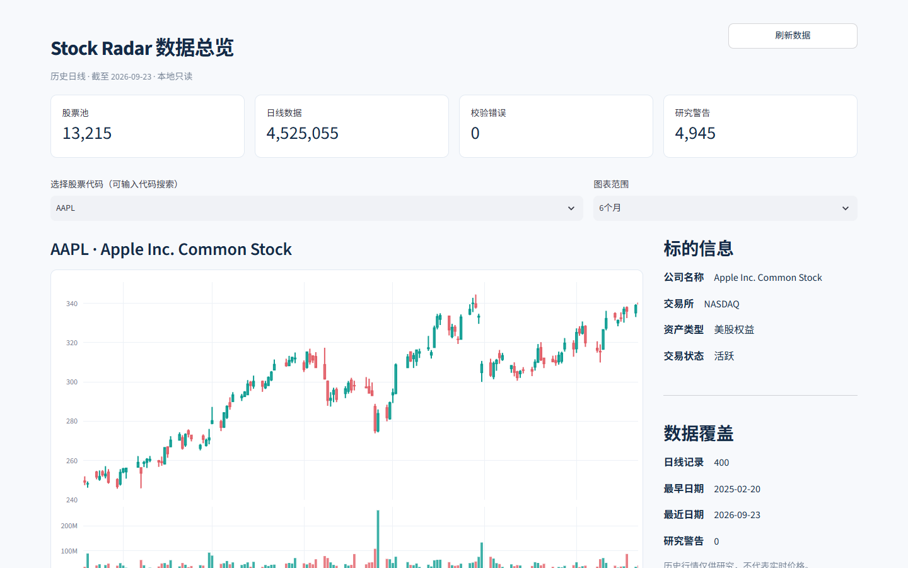
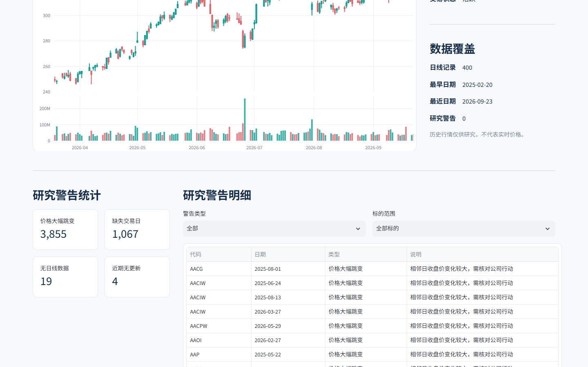
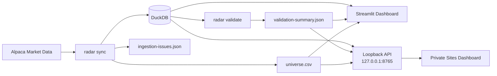

<p align="center">
  <strong>English</strong> · <a href="./README.zh-CN.md">简体中文</a>
</p>

<h1 align="center">📡 Stock Radar</h1>

<p align="center">
  <strong>Local-first US equity market-data research infrastructure.</strong><br>
  Alpaca ingestion · DuckDB storage · validation · read-only dashboards
</p>

<p align="center">
  
  
  
  
  
  
</p>

> [!IMPORTANT]
> Stock Radar is research software only. **Nothing in this repository places orders.** No trading or order endpoint is called anywhere in the package. Strategy 2 scoring and backtests are future work and are **not implemented**.

## Overview

Stock Radar builds a reproducible local data foundation for broad US-equity research. It maintains an asset master, downloads split-adjusted daily OHLCV bars from Alpaca SIP, stores them in DuckDB, validates the stored history, exports the eligible universe, and exposes the results through read-only dashboards.

The project is deliberately **local-first**: credentials, DuckDB data, validation reports, and the loopback API stay on the machine running Stock Radar.

### What it does

| Capability | Implementation |
| --- | --- |
| Market-data ingestion | Alpaca US-equity asset master + daily SIP bars |
| Incremental updates | Downloads missing market sessions and upserts compatible rows |
| Local storage | DuckDB with provider/feed/adjustment provenance |
| Validation | Non-destructive checks for gaps, malformed rows, stale symbols, and warnings |
| Universe export | CSV of eligible active/tradable US equities on major venues |
| Local dashboard | Searchable Streamlit + Plotly OHLCV and coverage views |
| Private browser dashboard | Static Site reading a read-only loopback API on `127.0.0.1` |
| Unattended refresh | Windows scheduled tasks for daily update and local API startup |

## Project status

- [x] Asset master and eligible-universe export
- [x] Historical daily OHLCV ingestion
- [x] Incremental session-aware synchronization
- [x] DuckDB persistence with provenance checks
- [x] Read-only validation pipeline
- [x] Streamlit local dashboard
- [x] Private Sites dashboard backed by a loopback API
- [x] Windows unattended daily refresh
- [ ] Strategy 2 scoring
- [ ] Backtesting engine

## Dashboard preview

<table>
  <tr>
    <td width="50%" align="center"><strong>Market overview</strong></td>
    <td width="50%" align="center"><strong>Validation warnings</strong></td>
  </tr>
  <tr>
    <td></td>
    <td></td>
  </tr>
</table>

## Architecture



The browser-facing private Site contains only HTML, CSS, and JavaScript. It reads data from the local loopback API; the DuckDB database and Alpaca credentials remain on the local computer.

## Quick start

### Requirements

- Python 3.11 or newer
- Alpaca API credentials for `sync` and `validate`
- PowerShell commands below assume Windows

From the project root:

```powershell
python -m venv .venv
& .\.venv\Scripts\python.exe -m pip install -e ".[dev]"
Copy-Item .env.example .env
```

Then edit the untracked `.env`:

```text
ALPACA_API_KEY=...
ALPACA_SECRET_KEY=...
```

Credentials are read from the environment first, then from `.env` in the project root via `python-dotenv`. Both keys are required for `sync` and `validate`; `init-db` needs neither. `.env` is gitignored — never commit credentials.

## Configuration

`config/base.yaml` drives every run:

```yaml
provider: alpaca
database_path: data/market.duckdb
daily_bars:
  feed: sip
  adjustment: split
  lookback_sessions: 400
```

- `feed: sip` — historical daily research explicitly uses Alpaca SIP; there is no automatic feed fallback.
- `adjustment: split` — daily bars are split-adjusted.
- `lookback_sessions: 400` — default window measured in Alpaca market sessions, not calendar days.
- `database_path` can be overridden by `RADAR_DB_PATH` from the environment or `.env`.

## Commands

Run commands from the project root. Settings and `.env` resolve against the current directory unless `--project-root` is supplied.

```powershell
python -m radar init-db
python -m radar sync
python -m radar validate
```

| Command | Purpose |
| --- | --- |
| `init-db` | Create `data/market.duckdb` and apply schema version 1. Safe to re-run. |
| `sync` | Refresh the asset master and universe, download missing daily sessions, and upsert them. |
| `validate` | Open the database read-only, validate stored bars, and write a JSON summary. |

`sync` and `validate` support bounded smoke-run options:

| Option | Meaning |
| --- | --- |
| `--end YYYY-MM-DD` | Last session date to cover. Default: previous US/Eastern day. |
| `--lookback N` | Number of market sessions, overriding `lookback_sessions`. |
| `--max-symbols N` | Limit work to the first N eligible symbols sorted by ticker. |

Example:

```powershell
python -m radar sync --end 2026-09-24 --lookback 5 --max-symbols 20
python -m radar validate --end 2026-09-24 --lookback 5 --max-symbols 20
```

Each command prints a one-line JSON result to stdout.

## Local Streamlit dashboard

Install the optional visualization dependencies and launch the read-only local dashboard:

```powershell
uv pip install --python .\.venv\Scripts\python.exe -e ".[viz]"
& .\.venv\Scripts\python.exe -m streamlit run src/radar/dashboard.py --server.address 127.0.0.1 --server.port 8501
```

Open `http://127.0.0.1:8501`.

The dashboard reads the existing DuckDB database, universe CSV, and validation report. It provides coverage statistics, validation warnings, and searchable single-symbol OHLCV charts. It does **not** call Alpaca, modify data, provide real-time quotes, or place orders.

Run `sync` and `validate` first if the output files are missing. Use **刷新数据** after those files change.

The interface uses the open-source [Streamlit](https://github.com/streamlit/streamlit) and [Plotly.py](https://github.com/plotly/plotly.py) components.

## Private Sites dashboard

The private [Sites dashboard](https://stock-radar-local.zhoushuming.chatgpt.site) hosts only HTML, CSS, and JavaScript. It reads market data from the read-only local API at `127.0.0.1:8765` on **this computer**.

After signing in to the Site, allow its browser prompt to access the local computer if one appears. Other computers cannot read this machine’s loopback API.

### Privacy boundary

- Alpaca credentials stay local.
- DuckDB and generated reports stay local.
- The local API listens on `127.0.0.1` only.
- The Site does not receive or store the market database through this setup.
- All dashboards are read-only with respect to trading and order execution.

## Unattended updates

Two Windows tasks are installed for the current user:

| Task | Schedule | Purpose |
| --- | --- | --- |
| `StockRadar-DailyUpdate` | Tuesday–Saturday at 08:30 China time, and at next logon | Update the most recent completed US trading day, backfill missing sessions, then validate. Successful target dates are skipped. |
| `StockRadar-LocalApi` | At logon | Serve the read-only local API on `127.0.0.1:8765`. |

Both use `pythonw.exe` and run without a console window. A missed update while the computer is off runs after the next logon; the computer must be online to reach Alpaca.

The database remains at `data/market.duckdb`; the latest job result is written to `data/daily-update-status.json`.

Inspect or trigger an update manually:

```powershell
Get-ScheduledTaskInfo -TaskName StockRadar-DailyUpdate
Get-Content data/daily-update-status.json
Start-ScheduledTask -TaskName StockRadar-DailyUpdate
```

The scheduled run reads Alpaca keys from `.env` when present, otherwise from `../alpacakey.txt` on this machine. Reinstall the tasks after moving the project or changing the Site address:

```powershell
& ./scripts/install-automation.ps1 -SiteOrigin "https://stock-radar-local.zhoushuming.chatgpt.site"
```

## Outputs

| Path | Contents |
| --- | --- |
| `data/market.duckdb` | DuckDB database containing `assets`, `daily_bars`, and `schema_migrations`. |
| `data/universe.csv` | Eligible universe sorted by symbol. |
| `data/validation-summary.json` | Latest validation summary with checked/accepted/rejected rows and structured issues. |
| `data/ingestion-issues.json` | Latest sync report with failed symbols and detailed ingestion issues. |
| `data/daily-update-status.json` | Latest unattended-update result. |

Generated files under `data/` are gitignored.

## Data conventions and limitations

<details>
<summary><strong>Expand technical notes</strong></summary>

### Asset universe

- **The asset master comes from current snapshots.** Alpaca is queried for active US-equity assets. Symbols delisted or renamed before the first `sync` do not enter the database, so historical research over the lookback window carries **survivor bias**. Previously observed assets remain in the master with an older `last_seen`; `validate` uses only the newest observed snapshot.
- **The eligible filter is intentionally coarse.** It keeps active, tradable US-equity assets listed on NASDAQ, NYSE, AMEX, ARCA, or BATS. ETFs, ADRs, preferred shares, and similar equity-like listings can pass the filter. OTC and non-major venues are excluded.

### Market data

- **No feed fallback.** If SIP access is rejected, the run fails instead of silently switching feeds.
- **Provenance is strict.** Bars store `provider`, `feed`, and `adjustment`. Existing rows may only be replaced by compatible data with the same provenance triple; conflicting series raise an error instead of being mixed.
- **Zero-volume bars keep nullable VWAP.** When Alpaca reports zero trades and `vwap = 0`, Stock Radar stores `NULL` rather than rejecting an otherwise valid bar.
- **Missing sessions are retried.** A session window with no stored bars is requested again on later `sync` runs.
- **Large price jumps warn rather than reject.** Close-to-close moves beyond the jump threshold are recorded as `abnormal_price_jump` warnings because corporate actions can produce legitimate discontinuities.
- **No corporate-action reconciliation.** There is no automatic merger/ticker-change reconciliation beyond the provider’s split adjustment.

### Validation

- **Validation is non-destructive.** It flags gaps, missing sessions, stale tickers, malformed rows, and warnings; it does not delete or repair data.

</details>

## Tests

The test suite is fully offline. It uses in-memory or temporary DuckDB databases and fake provider objects; it never contacts Alpaca or reads real credentials.

```powershell
& .\.venv\Scripts\python.exe -m pytest
```

`pyproject.toml` sets `testpaths = ["tests"]` and `pythonpath = ["src"]`, so a bare `pytest` from the project root works too.

## Repository layout

```text
stock-radar/
├── config/      # Runtime configuration
├── data/        # Generated local data (gitignored)
├── docs/        # Screenshots and documentation assets
├── scripts/     # Local automation helpers
├── site/        # Static private dashboard assets
├── src/         # Python package
├── tests/       # Offline test suite
├── .env.example
├── pyproject.toml
└── README.md
```

---

<p align="center">
  Built as a research-data foundation first: reproducibility, provenance, validation, and local control before strategy logic.
</p>