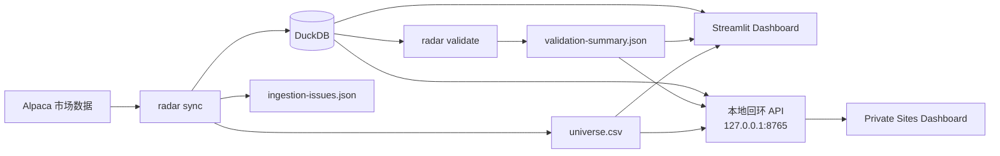

<p align="center">
  <a href="./README.md">English</a> · <strong>简体中文</strong>
</p>

<h1 align="center">📡 Stock Radar</h1>

<p align="center">
  
</p>

<p align="center">
  <strong>本地优先的美股市场数据研究基础设施。</strong><br>
  Alpaca 数据采集 · DuckDB 存储 · 数据校验 · 只读可视化
</p>

<p align="center">
  
  
  
  
  
  
</p>

<p align="center">
  <sub>研究用途 · 本地优先 · 不执行下单</sub>
</p>

> [!IMPORTANT]
> Stock Radar 仅用于研究。**本仓库中的任何代码都不会执行下单。** 项目不会调用交易或订单接口。Strategy2、组合回测与本机 Scanner Research 均已实现；Scanner 现为主要研究路径，回测用于次级诊断。

## 当前研究方向：候选股优先

Scanner Research 按交易日保存策略筛选出的完整候选排序、子评分和可选概率；主程序随后按次一交易日开盘价计算未来 10 个交易日的命中率、MFE/MAE、跌破信号日低点与“假企稳继续下跌”标签。界面显示 Top 5/10/20 的 Precision 和相对同日合格股票池的 Lift。此模式不创建仓位，也不把组合收益当作候选质量的唯一依据。

本地入口：双击根目录 `启动本地看板.cmd`，打开 `127.0.0.1:8502` 或 `localhost:4174/lab.html#scanner`。组合回测在同一网页的 Strategy Backtest 页；止盈、止损和最长持有天数由每个策略的 `exit` 参数决定，`null` 表示关闭相应自动退出。完整配置、标签公式与限制见 [策略插件规范](docs/STRATEGY_PLUGIN_SPEC.md)。

## 快速导航

- [项目简介](#项目简介)
- [主要能力](#主要能力)
- [Dashboard 预览](#dashboard-预览)
- [系统架构](#系统架构)
- [快速开始](#快速开始)

## 项目简介

Stock Radar 用于构建可复现、可校验的本地美股研究数据底座：维护股票资产主表，从 Alpaca SIP 下载经过拆股调整的日线 OHLCV，写入 DuckDB，对历史数据进行非破坏性校验，导出可研究股票池，并通过只读 Dashboard 展示结果。

项目强调 **local-first（本地优先）**：API 凭据、DuckDB 数据库、校验报告和回环 API 都保留在运行 Stock Radar 的本机。

### 主要能力

| 能力 | 实现 |
| --- | --- |
| 市场数据采集 | Alpaca 美股资产主表 + SIP 日线数据 |
| 增量更新 | 仅下载缺失交易日，并对兼容数据执行 upsert |
| 本地存储 | DuckDB，并记录 provider/feed/adjustment 来源信息 |
| 数据校验 | 非破坏性检查缺口、异常行、过期标的与警告 |
| 股票池导出 | 导出主要交易所中符合条件的活跃、可交易美股 |
| 本地 Dashboard | Streamlit + Plotly，可搜索单股并查看 OHLCV 与覆盖情况 |
| 私有浏览器 Dashboard | 静态 Site 通过 `127.0.0.1` 的只读本地 API 获取数据 |
| 无人值守刷新 | Windows 计划任务负责每日更新与本地 API 自启动 |

## 当前进度

- [x] 资产主表与股票池导出
- [x] 历史日线 OHLCV 采集
- [x] 按交易日增量同步
- [x] 带来源约束的 DuckDB 持久化
- [x] 只读数据校验流程
- [x] Streamlit 本地 Dashboard
- [x] 基于回环 API 的私有 Sites Dashboard
- [x] Windows 无人值守日更
- [x] Strategy 2 评分
- [x] 回测引擎（次级研究工具）
- [x] Scanner Research 候选快照、前瞻标签与质量指标

## Dashboard 预览

<table>
  <tr>
    <td width="50%" align="center"><strong>市场概览</strong></td>
    <td width="50%" align="center"><strong>数据校验警告</strong></td>
  </tr>
  <tr>
    <td></td>
    <td></td>
  </tr>
</table>

## 系统架构



浏览器端的私有 Site 只包含 HTML、CSS 和 JavaScript。它通过本机回环 API 读取数据；DuckDB 数据库和 Alpaca 凭据不会因此上传到 Site。

## 快速开始

### 环境要求

- Python 3.11 或更高版本
- `sync` 和 `validate` 需要 Alpaca API 凭据
- 以下命令以 Windows PowerShell 为例

在项目根目录执行：

```powershell
python -m venv .venv
& .\.venv\Scripts\python.exe -m pip install -e ".[dev]"
Copy-Item .env.example .env
```

然后编辑不会被 Git 跟踪的 `.env`：

```text
ALPACA_API_KEY=...
ALPACA_SECRET_KEY=...
```

程序会优先读取系统环境变量，其次读取项目根目录 `.env` 中的凭据（通过 `python-dotenv`）。`sync` 和 `validate` 都需要两项密钥；`init-db` 不需要。`.env` 已加入 gitignore，**不要提交真实密钥**。

## 配置

所有运行都由 `config/base.yaml` 驱动：

```yaml
provider: alpaca
database_path: data/market.duckdb
daily_bars:
  feed: sip
  adjustment: split
  lookback_sessions: 400
```

- `feed: sip`：历史日线研究显式使用 Alpaca SIP，不会自动降级到其他 feed。
- `adjustment: split`：日线按拆股进行调整。
- `lookback_sessions: 400`：默认覆盖 400 个 Alpaca 市场交易日，而不是 400 个自然日。
- `database_path` 可由环境变量或 `.env` 中的 `RADAR_DB_PATH` 覆盖。

## 命令

请从项目根目录执行。除非指定 `--project-root`，设置和 `.env` 都以当前目录为基准解析。

```powershell
python -m radar init-db
python -m radar sync
python -m radar validate
```

| 命令 | 作用 |
| --- | --- |
| `init-db` | 创建 `data/market.duckdb` 并应用 schema version 1；可安全重复执行。 |
| `sync` | 刷新资产主表与股票池，下载缺失日线交易日并写入数据库。 |
| `validate` | 只读打开数据库，对已存数据进行校验并输出 JSON 摘要。 |

`sync` 和 `validate` 支持限制范围的 smoke run：

| 参数 | 含义 |
| --- | --- |
| `--end YYYY-MM-DD` | 覆盖到的最后一个交易日；默认是 US/Eastern 的前一日。 |
| `--lookback N` | 交易日数量，覆盖 `lookback_sessions`。 |
| `--max-symbols N` | 只处理按 ticker 排序后的前 N 个符合条件的标的。 |

示例：

```powershell
python -m radar sync --end 2026-09-24 --lookback 5 --max-symbols 20
python -m radar validate --end 2026-09-24 --lookback 5 --max-symbols 20
```

每个命令都会向 stdout 输出一行 JSON 结果。

## 本地网页

### 一键打开本地网页

在项目文件夹中双击 `启动本地看板.cmd`。它会同时打开 `127.0.0.1:8502` 的 Streamlit 策略实验室和 `127.0.0.1:4174/lab.html` 的本地网页，并启动或复用 `127.0.0.1:8765` 数据接口。两个入口都能查看三阶段逐日时间线；4174 页面导航还可进入行情看板。网页直接使用 `site/dist/` 中的文件，修改本地网页后无需重新部署 Sites。数据库、策略和回测结果仍留在本机。大版本完成后再按需部署 Sites。

首次使用需先按项目安装说明创建 `.venv`。如果服务启动失败，启动窗口会显示错误并停留，方便排查。自动行情更新仍由 `StockRadar-DailyUpdate` 计划任务负责。

### Streamlit Dashboard

安装可视化可选依赖并启动只读 Dashboard：

```powershell
uv pip install --python .\.venv\Scripts\python.exe -e ".[viz]"
& .\.venv\Scripts\python.exe -m streamlit run src/radar/dashboard.py --server.address 127.0.0.1 --server.port 8501
```

浏览器打开 `http://127.0.0.1:8501`。

Dashboard 读取现有 DuckDB、股票池 CSV 和校验报告，可查看数据覆盖、校验警告以及可搜索的单股 OHLCV 图表。它**不会**调用 Alpaca、修改数据、提供实时行情或执行交易。

如果输出文件还不存在，请先执行 `sync` 和 `validate`；文件变化后可点击 **刷新数据**。

界面使用开源的 [Streamlit](https://github.com/streamlit/streamlit) 和 [Plotly.py](https://github.com/plotly/plotly.py)。

## 私有 Sites Dashboard

私有 [Sites dashboard](https://stock-radar-local.zhoushuming.chatgpt.site) 仅托管 HTML、CSS 和 JavaScript。它从**当前这台电脑**上的 `127.0.0.1:8765` 只读 API 获取市场数据。

登录 Site 后，如果浏览器弹出访问本地计算机的提示，需要允许访问。其他电脑无法通过该地址读取这台机器的 loopback API。

### 隐私边界

- Alpaca 凭据保留在本地。
- DuckDB 和生成的报告保留在本地。
- 本地 API 仅监听 `127.0.0.1`。
- 按当前架构，Site 不会接收或存储市场数据库。
- 所有 Dashboard 对交易和订单执行而言都是只读的。

## 无人值守更新

当前用户安装了两个 Windows 计划任务：

| 任务 | 时间 | 作用 |
| --- | --- | --- |
| `StockRadar-DailyUpdate` | 中国时间周二至周六 08:30，并在下次登录时补跑 | 更新最近一个已完成的美股交易日、回填缺失交易日，然后执行校验；已成功完成的目标日期会跳过。 |
| `StockRadar-LocalApi` | 登录时 | 在 `127.0.0.1:8765` 启动只读本地 API。 |

两者都使用 `pythonw.exe`，不会弹出控制台窗口。电脑关机期间错过的更新会在下次登录后运行；连接 Alpaca 时电脑必须联网。

数据库仍位于 `data/market.duckdb`，最近一次任务结果写入 `data/daily-update-status.json`。

手动查看或触发更新：

```powershell
Get-ScheduledTaskInfo -TaskName StockRadar-DailyUpdate
Get-Content data/daily-update-status.json
Start-ScheduledTask -TaskName StockRadar-DailyUpdate
```

计划任务优先从 `.env` 读取 Alpaca 密钥；若不存在，则从本机 `../alpacakey.txt` 读取。项目移动或 Site 地址变化后，需要重新安装任务：

```powershell
& ./scripts/install-automation.ps1 -SiteOrigin "https://stock-radar-local.zhoushuming.chatgpt.site"
```

## 输出文件

| 路径 | 内容 |
| --- | --- |
| `data/market.duckdb` | DuckDB 数据库，包含 `assets`、`daily_bars` 和 `schema_migrations`。 |
| `data/universe.csv` | 按 symbol 排序的符合条件股票池。 |
| `data/validation-summary.json` | 最近一次校验摘要，包含 checked/accepted/rejected 行数和结构化问题。 |
| `data/ingestion-issues.json` | 最近一次同步报告，包含失败标的与详细采集问题。 |
| `data/daily-update-status.json` | 最近一次无人值守更新结果。 |

`data/` 下生成的数据文件均被 gitignore。

## 数据约定与局限

<details>
<summary><strong>展开技术说明</strong></summary>

### 股票池

- **资产主表来自当前快照。** Alpaca 只返回当前活跃的美股资产。首次 `sync` 之前已经退市或改名的 ticker 不会进入数据库，因此对历史窗口的研究存在**幸存者偏差**。之前观察到、之后不再出现的资产会保留较旧的 `last_seen`；`validate` 只使用最新资产快照。
- **eligible 过滤较粗。** 当前保留在 NASDAQ、NYSE、AMEX、ARCA 或 BATS 上市，且状态为 active、tradable 的 US-equity 资产。ETF、ADR、优先股以及类似的权益类证券也可能通过过滤；OTC 和非主要交易场所会被排除。

### 市场数据

- **不自动切换 feed。** 如果 SIP 权限被拒绝，任务会失败，而不是静默切到其他 feed。
- **严格记录数据来源。** 每根 bar 都保存 `provider`、`feed`、`adjustment`。已有数据只能被来源三元组一致的数据覆盖；冲突数据会报错，避免不同序列混在一起。
- **零成交量 bar 的 VWAP 可为空。** 当 Alpaca 返回零成交且 `vwap = 0` 时，Stock Radar 存储 `NULL`，而不是拒绝整根 bar。
- **缺失交易日会继续重试。** 某个交易日窗口没有存储数据时，后续 `sync` 会再次请求。
- **大幅跳价只警告，不直接拒绝。** 超过阈值的收盘价跳变会记录为 `abnormal_price_jump`，因为拆股等公司行动可能造成合法的不连续。
- **没有完整的公司行动对账。** 除供应商提供的拆股调整外，目前不会自动处理合并、ticker 变更等事件。

### 校验

- **校验过程非破坏性。** 它会标记缺口、缺失交易日、过期 ticker、异常行和警告，但不会删除或自动修复数据。

</details>

## 测试

测试套件完全离线运行：使用内存或临时 DuckDB 和伪造 provider 对象，不会访问 Alpaca，也不会读取真实凭据。

```powershell
& .\.venv\Scripts\python.exe -m pytest
```

`pyproject.toml` 已配置 `testpaths = ["tests"]` 和 `pythonpath = ["src"]`，因此也可以直接在项目根目录运行 `pytest`。

## 仓库结构

```text
stock-radar/
├── config/      # 运行配置
├── data/        # 本地生成数据（gitignored）
├── docs/        # 截图与文档资源
├── scripts/     # 本地自动化辅助脚本
├── site/        # 私有静态 Dashboard 资源
├── src/         # Python 包
├── tests/       # 离线测试
├── .env.example
├── pyproject.toml
└── README.md
```

---

<p align="center">
  先把研究数据底座做扎实：可复现、可追溯、可校验、本地可控，再向策略逻辑扩展。
</p>
