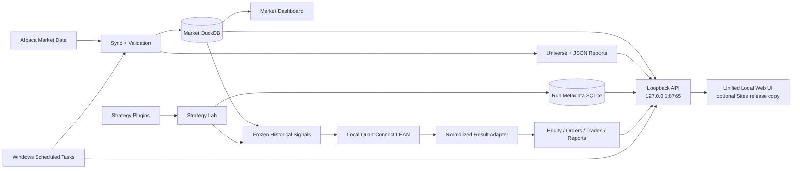

<p align="center">
  <a href="./README.md">English</a> · <strong>简体中文</strong>
</p>

<h1 align="center">📡 Stock Radar</h1>

<p align="center">
  
</p>

<p align="center">
  <strong>把主观盘感转成可度量、可验证候选池的本地优先美股量化雷达。</strong><br>
  市场数据 · 形态量化 · 候选排序 · 历史验证 · 可复现研究
</p>

<p align="center">
  
  
  
  
  
  
</p>

<p align="center">
  <sub>研究用途 · 本地优先 · 可复现 · 不执行券商下单</sub>
</p>

> [!IMPORTANT]
> Stock Radar 仅用于研究。**本仓库中的任何代码都不会向券商发送订单。** 项目正在从“通用回测平台”重新聚焦为“个人量化选股研究系统”。核心问题不再是历史组合收益能做到多高，而是能否把主观交易语言转成因果、可复现、可检验的市场特征，并验证这些候选是否真的富集了更有利的后续走势。现有回测结果**不能证明存在可部署的交易优势**；此前已经查看过的 Test 区间属于探索性结果，而不是新的独立样本外证据。

<p align="center">
  <a href="#项目简介">项目简介</a> ·
  <a href="#界面预览">界面预览</a> ·
  <a href="#当前进度">当前进度</a> ·
  <a href="#系统架构">系统架构</a> ·
  <a href="#快速开始">快速开始</a> ·
  <a href="#本地-strategy-labphase-3">Strategy Lab</a> ·
  <a href="#数据约定与局限">数据局限</a>
</p>

## 项目简介

**本地数据库最终状态 · 2026-10-08：** Research Infrastructure v1 已冻结，Shape Research READY，General PIT Tier 1 作为深度/审计层。主动全市场扩建 CLOSED，维护 ACTIVE，可恢复 Strategy 2 形态/因子研究与视觉训练准备。默认安全 K 线 5,407,961 条，技术 ready 为已观测普通股交易日的 83.8733%；Fresh 决策回看已修正，正式冻结策略 QC 验证仍为 NOT_RUN。[基础设施与统一入口](docs/RESEARCH_INFRASTRUCTURE_V1.md)、[47 项收口报告](reports/research-infrastructure-v1-finalization-2026-10-08.md)。

**当前阶段 · 2026-10-07：** 研究基础设施和本地 LEAN 接入已验收；新增开放历史快照 PIT 重建、独立证券身份边界特征库和按日 Scanner 接入。历史身份、普通股分类及退市行情覆盖仍不完整，PIT LEAN 执行继续拒绝。
[PIT 数据库验收报告](reports/acceptance/pit-acceptance-2026-10-07.md)记录数据来源、差异及未完成边界。

最新研究级专项：新增独立 `research-grade` 门禁，保留原严格门禁。
自动通过2,597个低风险身份，独立接受906,095条原始行情，补回66,236条旧缺价。
动态历史Core每天暂定1,000只，并保留52–111个资格未知的竞争者；同策略参数的A/B/C
Scanner已实际计算。真实Research-Grade PIT Native LEAN仍被身份、重大事件、缺价与
人口不确定性阻塞，不能宣称无幸存者偏差或稳定alpha。System及新增
`/api/lab/pit-research-readiness`明确显示研究级标签，禁止回退Current；现有常驻服务需
正常重载才能加载新增接口。[研究级验收报告](reports/acceptance/pit-research-grade-acceptance-2026-10-07.md)
包含三层缺口、敏感性结果、证据哈希和15项验收答复。
最新决策范围审计：身份安全口径仍有29–72个/日可能竞争者，Full/Core每日Top3重合
19.9115%；Core实际候选尚有106个未解决身份、12个执行日期及10个事件/价格审查目标。
已接受10条SMR持仓范围补充行情，未发布新Native输入，正式PIT组合继续NOT_RUN。
[最终20项验收](reports/pit-research-final-acceptance-2026-10-07.md)与
[P0队列](reports/evidence/pit-research-final-priority-2026-10-07.json)给出剩余决策范围，
不再清洗全市场无关缺口。新审计通过CLI提供，现有API/Native保持原冻结阻塞门禁。
[本轮可信度与退出行情验收](reports/acceptance/pit-data-trust-acceptance-2026-10-07.md)记录 9 个已核验身份、1,462 条真实补价、数据库耦合、六维 readiness 和旧库定时更新例外。
[开发阶段报告](reports/current/development-status-2026-10-06.md)说明已完成能力、验收范围、限制和待办。
网页新回测只使用 LEAN，Stock Radar 保留全部策略/选股逻辑；安装路径可配置，旧版网页已封存到 GitHub 标签。

Stock Radar 是一个个人美股量化研究系统，围绕一个非常具体的实际流程构建：先把全市场几千只股票压缩成少量最符合目标价格结构的观察对象，再把新闻、催化剂、基本面、盘前状态等非价格信息留给第二阶段研究。

整体仍坚持 **local-first（本地优先）**：Alpaca 凭据、DuckDB 市场数据库、策略插件、Run 元数据以及详细研究产物都保留在运行 Stock Radar 的本机。私有浏览器 Dashboard 只通过本机 loopback API 与这些数据交互。

代码、网页、配置模板和纳入版本管理的文档以 GitHub `main` 为准。开始修改前先从 `origin/main` 获取并快进同步，检查本地差异，再把验收通过的修改推回 `main`。本地网站直接使用本仓库的 `site/dist`。`data/` 中的行情库、运行历史、凭据和生成的导出文件只保留在本机，代码同步时不覆盖它们。

## 界面预览

以下截图于 2026 年 9 月 30 日从本地网站截取，早于 LEAN-only 入口切换；展示保留的布局，
不是本次引擎验收截图。图中的数字属于本机历史研究数据，不是实时行情或交易信号。

**行情总览**：日 K、成交量、数据覆盖与校验状态。


**Scanner 研究**：候选质量、事件指标和逐日候选快照。


**回测研究**：历史运行配置、权益曲线、回撤和持仓。


## 研究方向

Stock Radar 正在从“追求漂亮历史净值曲线”重新聚焦到 **形态量化（pattern quantification）**。

实际工作流希望变成：

```text
全美股股票池
→ 因果、可解释的量化初筛
→ 少量排序后的候选股票
→ 后续由 GPT 辅助检查新闻、催化、基本面与盘前状态
→ 必要时再做分时确认
```

当前核心研究问题是：

1. “前期很强、跌下来很多、开始跌不动、附近有承接、可能准备向上扩张”这类主观盘感，能否被翻译成可测量的市场特征？
2. 量化系统筛出来的股票，是否真的和人工看图时认为“符合形态”的股票一致？
3. 在完全不看新闻和基本面的情况下，这些候选是否已经显著富集了未来固定窗口内的有利走势？
4. 后续加入 GPT 的新闻、催化、基本面和盘前复核后，是否还能提供可测量的增量价值？

历史回测继续作为 **验证工具**。Scanner 已实现前瞻结果 Precision/Lift、MFE/MAE 和描述性环境分层；
下一阶段检验这些指标的有效性与稳定性，补充人工形态标签评价和概率校准：

- Precision@5 / Precision@10 / Precision@20
- 相对 eligible universe 基础命中率的 Lift@K
- 未来固定窗口达到 +3%、+5%、+8%、+10% 的校准概率
- MFE / MAE 与 time-to-target
- False Falling-Knife / signal 后继续创新低比例
- 按年份、牛熊环境与波动状态拆分后的稳定性

当前研究路线：

- **Quant**：用连续、宽松、高召回的价格/成交量因子先把全市场压缩成候选池；这一阶段 Quant 负责“找题”，不是直接给最终答案。
- **Human → Vision**：用户对 Quant 候选图标注 **观察 / 不观察 / 不确定**，并独立标注 **当前可买 / 等回落或确认 / 不买 / 不确定**；Vision M1 只看图像，学习人工难以写成规则的判断。
- **Fusion**：先经历 Quant + Vision + Human 的主动学习过渡，再逐步让人工退出逐笔决策，最终冻结为 **Quant + Vision**。正式比较必须包含 Quant-only、Vision-only、Quant+Vision。
- **Intraday**：只对日线候选补充分钟数据，用于研究承接、转强与执行确认，而不是一开始就下载全市场多年分钟数据。

此前随机盲图 Single/Pair Pilot 继续作为 P0/P1 工程验收证据，但“不加上下文地完成50张Single+25组Pair”不再是当前研究任务。现行主线见 [Quant + Vision Fusion Research Plan v1](docs/QUANT_VISION_FUSION_RESEARCH_PLAN.md)。

长期目标不是复制一个覆盖所有资产和执行方式的机构级通用交易系统，而是做成一个可复现的 **Personal Quantitative Stock Radar**：把个人交易语言变成机器可以稳定搜索、可以证伪、可以长期积累的数据流程，并作为人工 / GPT 盘前研究的第一层候选生成器。
### 主要能力

| 层级 | 当前实现 |
| --- | --- |
| **Phase 1 · 数据基础** | 资产主表、拆股调整日线 OHLCV、增量同步、数据校验、股票池导出、DuckDB 来源一致性检查 |
| **历史 Phase 2 · 兼容层** | 冻结基线、早期 Strategy 2 研究和旧核算结果，保留为历史证据和迁移验证器 |
| **策略研究 / Scanner** | 插件 v1、可信 ZIP、因果逐日候选快照、前瞻评价、Precision/Lift、cooldown 事件指标、筛选漏斗与市场环境分层 |
| **正式回测执行** | 独立本地 QuantConnect LEAN、冻结信号/价格、原生组合执行、统一结果适配、逐笔/逐日对照与引擎审计 |
| **研究工作流** | 持久化共享队列、三阶段时间线、曲线/持仓/交易、历史重命名/归档/恢复、Compare、有限实验与证据导出 |
| **可视化** | 单一 Web 界面涵盖市场数据、Scanner、回测、策略与实验；本地 API 使用 8765 端口 |
| **自动化** | Windows 计划任务负责市场数据日更与本地 API 自启动 |
| **执行边界** | 不存在券商下单路径；研究 Run 和 Dashboard 不执行真实交易 |

## 当前进度

**截至 2026-10-06：研究基础设施已可用，本地 LEAN 第一版执行接入已通过工程验收。**
2026-10-07 数据库专项增补：**314 项测试通过，1 项既有弃用警告**，包含原生 LEAN 回归。PIT 与 Current Snapshot 并行；旧库保留。第一版 PIT 是探索性重建，不能声明 survivorship-bias-free，未进行 PIT 收益或策略优化。
同日可信度专项增补：**342 项测试通过**；ATVI/TWTR/SPLK 行情已进入独立 PIT 特征库，Scanner 特征及标签价格共享身份和 hash 边界。策略参数完全冻结，正式 PIT LEAN 继续拒绝；三库与首版 hash 一致，market 的新增行情来自本任务之前的定时更新并完整保留。
网页单阶段回测、三阶段顺序时间线和 Backtest 实验只使用 LEAN；Stock Radar 仍是唯一的
策略判断、因子和选股来源。原网页继续展示资金曲线、回撤、Benchmark、持仓、交易、
历史、Compare 和审计。旧结果保留并标记归档，旧内核只作兼容和对照验证。

- [详细开发阶段报告](reports/current/development-status-2026-10-06.md)
- [当前总账与未完成事项](reports/journey-2026-09-30-0651-📌当前总账.md)
- [LEAN 安装要求、信号/结果契约与执行假设](docs/LEAN_EXECUTION.md)
- [GitHub 封存的旧版网页](https://github.com/zhoushuming073-cell/stock-radar/tree/legacy-backtest-ui-2026-10-06)

2026-10-06 已记录的验收：**272 项测试通过，1 项既有弃用警告**，包含真实本地 LEAN
对照测试；一个历史 Scanner 快照完成 **245 个交易日、96 笔已平仓交易**的原生 smoke
run，并在现有网页显示曲线、持仓、交易和引擎审计。上述是本地工程验收证据，
不等于 GitHub CI 验收、Fresh OOS 验收或策略盈利能力证明。详细资金与原始结果留在本机。

- [x] 资产主表与 eligible universe 导出
- [x] Alpaca SIP 日线增量采集
- [x] 带 provider/feed/adjustment 来源约束的 DuckDB 存储
- [x] 非破坏性市场数据校验
- [x] 本地 Web 市场概览与研究实验室
- [x] 旧回测内核与冻结 baseline 保留为兼容验证器
- [x] 网页只使用 LEAN、统一结果适配、原生对照测试与浏览器验收
- [x] 首个七阶段 Strategy 2 研究候选
- [x] Strategy plugin interface v1 与 ZIP 模板
- [x] 持久化本地 Strategy Lab 与 Run 队列
- [x] 参数网格、阶段消融与 rolling walk-forward 实验
- [x] 私有 Sites 集成与无人值守本地更新
- [x] Scanner Research 候选快照、前瞻标签与候选质量指标
- [x] 建立盲态 K 线 snapshot / Label Studio 基础设施（P0/P1）
- [x] 随机盲图 50 Single +25 Pair 不再作为主训练任务；保留为工程证据
- [ ] 构建 Quant-guided Human Labeling v1（宽候选池 + Observe / Entry Readiness）
- [ ] 用真实人工标签训练首版 image-only Vision M1
- [ ] 进入 Quant + Vision + Human 主动学习过渡，并最终冻结 Quant + Vision
- [x] 前瞻结果 Precision/Lift、可配置 Top-K、cooldown 事件 Precision/Lift、MFE/MAE 与 primary outcome 环境分层
- [ ] 同一 universe / split / outcome 下比较 Quant-only、Vision-only、Quant+Vision
- [ ] 固定窗口的目标命中概率研究与概率校准
- [ ] 超出已有描述性分层的市场环境条件化模型
- [ ] 独立的一键最新交易日 Daily Scanner（当前 Scanner 为历史区间研究）
- [ ] LEAN 完整 PIT / 公司行动 / 真实结算模拟
- [ ] candidate-only 分钟数据，用于承接 / 转强 / 执行研究
- [ ] Quant-guided Human → Vision → Quant+Vision Fusion 对照研究（当前主线）
- [ ] 为未来 GPT 二筛保存 point-in-time 候选与上下文研究日志
- [ ] 使用全新、未查看过的样本外区间验证策略改进
- [ ] 券商执行 / 实盘交易——有意不实现

## 系统架构



市场数据库对研究 worker 保持只读。Strategy Lab 使用独立的本地 SQLite WAL 保存可复现元数据；如果排队后的 Run 检测到 source/data hash 变化，会直接失败，而不是静默使用变化后的输入执行。

## 快速开始

### 环境要求

- Stock Radar 使用 Python 3.11 或更高版本
- LEAN 回测还需独立编译安装；安装 Python 包并不会安装 LEAN，详见 [LEAN 接入说明](docs/LEAN_EXECUTION.md)
- `sync` 和 `validate` 需要 Alpaca API 凭据
- 以下命令以 Windows PowerShell 为例

在项目根目录执行：

```powershell
python -m venv .venv
& .\.venv\Scripts\python.exe -m pip install -e ".[dev]"
Copy-Item .env.example .env
```

然后编辑不会被 Git 跟踪的 `.env`：

```text
ALPACA_API_KEY=...
ALPACA_SECRET_KEY=...
```

程序会优先读取系统环境变量，其次读取项目根目录 `.env` 中的凭据（通过 `python-dotenv`）。`sync` 和 `validate` 都需要两项密钥；`init-db` 不需要。`.env` 已加入 gitignore，**不要提交真实密钥**。

## 配置

`config/base.yaml` 配置行情采集，`config/research.yaml` 定义研究切分，
`config/lean.yaml` 配置独立回测引擎（默认 `D:\QuantConnect-LEAN`，可由
`STOCK_RADAR_LEAN_ROOT` 覆盖）：

```yaml
provider: alpaca
database_path: data/market.duckdb
daily_bars:
  feed: sip
  adjustment: split
  lookback_sessions: 400
```

- `feed: sip`：历史日线研究显式使用 Alpaca SIP，不会自动降级到其他 feed。
- `adjustment: split`：日线按拆股进行调整。
- `lookback_sessions: 400`：默认覆盖 400 个 Alpaca 市场交易日，而不是 400 个自然日。
- `database_path` 可由环境变量或 `.env` 中的 `RADAR_DB_PATH` 覆盖。

## 命令

请从项目根目录执行。除非指定 `--project-root`，设置和 `.env` 都以当前目录为基准解析。

```powershell
python -m radar init-db
python -m radar sync
python -m radar validate
```

| 命令 | 作用 |
| --- | --- |
| `init-db` | 创建 `data/market.duckdb` 并应用 schema version 1；可安全重复执行。 |
| `sync` | 刷新资产主表与股票池，下载缺失日线交易日并写入数据库。 |
| `validate` | 只读打开数据库，对已存数据进行校验并输出 JSON 摘要。 |

`sync` 和 `validate` 支持限制范围的 smoke run：

| 参数 | 含义 |
| --- | --- |
| `--end YYYY-MM-DD` | 覆盖到的最后一个交易日；默认是 US/Eastern 的前一日。 |
| `--lookback N` | 交易日数量，覆盖 `lookback_sessions`。 |
| `--max-symbols N` | 只处理按 ticker 排序后的前 N 个符合条件的标的。 |

示例：

```powershell
python -m radar sync --end 2026-09-24 --lookback 5 --max-symbols 20
python -m radar validate --end 2026-09-24 --lookback 5 --max-symbols 20
```

每个命令都会向 stdout 输出一行 JSON 结果。

## 本地 Web 看板

在项目根目录双击 `启动本地看板.cmd`。启动器会启动或复用本地 Web 页面
`http://127.0.0.1:4174` 和本地 API `http://127.0.0.1:8765`，只打开一个 Scanner 页面。
**Market Overview** 可查看股票池和日线数量、校验警告、标的覆盖信息，以及单股历史 OHLCV 图表。
页面提供只读行情和校验信息；点击 **Sync from Alpaca** 会触发已有的后台计划任务，页面显示最近同步状态与交易所覆盖率。页面不提供实时行情，也不执行交易。
如果输出文件尚不存在，先运行 `sync` 和 `validate`；文件更新后刷新浏览器。**System** 页面显示只读研究默认配置。

## 本地 Scanner Research（v1.5）

Scanner Research 是当前主要研究入口。它按交易日保存完整候选排序与诊断子评分，由主程序在后续十个交易日计算前瞻标签，并展示 Top 5/10/20 的 Precision、Lift、MFE/MAE 与市场环境分层结果。此模式不创建模拟仓位；组合回测由本地 LEAN 执行，用于次级诊断。止盈、止损和最长持有天数由各策略的 `exit` 参数控制，`null` 表示关闭对应自动退出。

新运行会保存统一的 `strategy/evaluation/execution/dataset` 参数值、来源和哈希。Scanner 现支持下行阈值、上涨目标先于下行阈值、同日先后顺序未知标记、重复信号事件计数、逐日筛选漏斗与近似入选股票的排除原因。浏览器把核心参数和高级参数分开显示，参数定义见[研究参数契约](docs/RESEARCH_PARAMETER_CONTRACT.md)。历史运行保留原有含义，不会自动重新计算。

当前默认股票池来自现时资产快照，历史研究存在幸存者偏差风险。项目提供历史 Git 快照 builder、区间型 PIT master、独立身份边界特征库和覆盖检查；生成数据留在本机，属于**探索性、不完整的历史重建**。仅导入当前 Alpaca 股票列表不能消除此风险。构建流程和限制见 [PIT 导入说明](docs/PIT_SECURITY_MASTER.md)。

在项目根目录双击 `启动本地看板.cmd`，即可打开唯一维护的本地网页 `http://127.0.0.1:4174/lab.html#scanner`，并启动或复用 `http://127.0.0.1:8765` 数据接口。网页可查看三阶段逐日时间线。本地修改 `site/dist/` 后无需部署 Sites；行情数据库、策略文件、凭据和研究结果均留在本机。标签公式、合格股票池和复现规则见 [策略插件规范](docs/STRATEGY_PLUGIN_SPEC.md)。

## 本地 Strategy Lab（Phase 3）

Strategy Lab 使用上述本地 Web 页面，发布版本也集成到现有 Sites Dashboard 的
[`/lab.html`](https://stock-radar-local.zhoushuming.chatgpt.site/lab.html)。网页可以导入可信来源的策略 ZIP、排队运行多个回测、逐日查看权益与回撤，并比较已完成的 Run。市场数据与 Run 结果仍保留在本机；Lab 不会向券商发送订单。

当前 `full_strategy2_v1` 插件安装在 `strategies/` 下。独立的编写指南和可直接打包为 ZIP 的示例位于 [Strategy Plugin specification](docs/STRATEGY_PLUGIN_SPEC.md) 与 `templates/strategy_plugin_template/`。

只应导入你信任作者提供的 Python 策略代码：结构检查、AST 检查与测试有助于验证插件，但它们并不是操作系统级 sandbox。

每个 Run 会把配置与可复现元数据写入本地 SQLite WAL：`data/strategy-lab/runs.sqlite3`；worker 则以只读方式访问市场 DuckDB。已完成 Run 不可修改。默认使用一个 Scanner / Backtest 共享 worker，显式配置可提高到最多四个，按最早可运行任务优先调度。Scanner / 兼容 Run 在 session 之间响应取消，LEAN Run 则终止原生子进程；如果 source/data hash 不匹配，排队中的 Run 会失败，而不是继续使用变化后的输入。

**历史旧内核插件迁移证据，与 LEAN 验收分别记录：** Phase 2 的完整 Strategy 2 迁移已经与保存的 Train、Validation 以及此前查看过的 Test 产物核对：1,231 个 signal dates，以及全部 equity、order、trade CSV 行均完全一致。可以本地重新验证：

```powershell
& .\.venv\Scripts\python.exe scripts/verify_phase3_plugin_parity.py
```

Test 区间在 Phase 3 之前已经被查看，因此属于探索性数据。不能把重复运行或在该区间上的参数比较当作新的样本外证据。开源组件选择和许可证说明见 [Phase 3 audit](docs/phase3-open-source-audit.md)。

实验面板可以排队执行有上限的参数网格（最多 64 个变体）、完整 Strategy 2 阶段消融（baseline 加八种 omission），以及 rolling walk-forward folds。实验只使用 Train/Validation 历史，并将每个变体保存为独立 Run。当前 walk-forward 在各 fold 之间保持参数固定，用于报告 OOS 分布，而不是在每个 fold 中重新拟合参数，从而避免造成“已经完成优化”的误导。

## 私有 Sites Dashboard 与无人值守更新

私有 [Sites dashboard](https://stock-radar-local.zhoushuming.chatgpt.site) 只托管 HTML、CSS 和 JavaScript。它通过**当前这台电脑**上的 loopback `127.0.0.1:8765` API 读取市场数据并控制本地研究 Run。

Dashboard 的市场数据接口保持只读；Strategy Lab 接口可以排队 Run，也可以为已配置的 Site origin 导入用户选择的 plugin ZIP。DuckDB、Run 结果、插件文件和 Alpaca 凭据都保留在本机。登录 Site 后，如果浏览器弹出访问本地计算机的提示，需要允许访问；其他电脑无法通过该 loopback 地址读取这台机器。

当前用户安装了两个 Windows 计划任务：

| 任务 | 时间 | 作用 |
| --- | --- | --- |
| `StockRadar-DailyUpdate` | 中国时间周二至周六 08:30，并在下次登录时补跑 | 更新最近一个已完成的美股交易日、回填缺失交易日，然后执行校验；已经成功完成的目标日期会跳过。 |
| `StockRadar-LocalApi` | 登录时 | 在 `127.0.0.1:8765` 提供本地 Dashboard 与 Strategy Lab API。 |

两者都使用 `pythonw.exe`，不会弹出控制台窗口。电脑关机期间错过的更新会在下次登录后运行；连接 Alpaca 时电脑必须联网。数据库仍位于 `data/market.duckdb`，最近一次任务结果写入 `data/daily-update-status.json`。按当前架构，市场数据不会因此上传到 Sites。

手动查看或触发更新：

```powershell
Get-ScheduledTaskInfo -TaskName StockRadar-DailyUpdate
Get-Content data/daily-update-status.json
Start-ScheduledTask -TaskName StockRadar-DailyUpdate
```

计划任务优先从 `.env` 读取 Alpaca 密钥；若不存在，则从本机 `../alpacakey.txt` 读取。项目移动或 Site 地址变化后，需要重新安装任务：

```powershell
& ./scripts/install-automation.ps1 -SiteOrigin 'https://stock-radar-local.zhoushuming.chatgpt.site'
```

## Phase 2 简化基线历史回测

> 归档的旧内核研究。以下命令与收益用于复现历史证据，不是当前正式网页回测入口，也不是 LEAN 结果。

Phase 2 研究使用本地 SIP、拆股调整后的日线数据，存放在 `data/phase2-research.duckdb`。研究数据库和详细交易文件保留在本机并被 gitignore。规则与样本切分定义位于 `config/research.yaml`、`config/backtest.yaml`，最终一次性 Test 冻结配置位于 `config/frozen_backtest_v1.yaml`。

冻结版 combined-rank baseline 在计入模型化手续费与滑点后得到：**Train -81.14%**、**Validation +4.49%**、**最终 Test -55.10%**。Test 组合从 $1,000,000 降至 $448,957.69。完整核算、benchmark、验证与局限见 [`reports/phase2/backtest_final.md`](reports/phase2/backtest_final.md)。本地运行后，交互图表位于 `data/research/final-test-v1/回测报告.html`。

如果本地研究数据库已经准备好，可复现命令为：

```powershell
& .\.venv\Scripts\python.exe scripts/run_backtest_research.py
& .\.venv\Scripts\python.exe scripts/run_frozen_backtest.py
& .\.venv\Scripts\python.exe scripts/verify_final_backtest.py
& .\.venv\Scripts\python.exe scripts/render_backtest_report.py
```

该基线候选主要按较高 Elasticity 和较深的 20-session drawdown 排名，但尚未同时要求 prior strength、downside exhaustion、support/absorption、停止创新低以及 early bullish confirmation，因此它的结果不能被描述为“完整 Strategy 2”的收益表现。

baseline 的最终 Test runner 会记录一次性评估标记；再次运行时会返回已经保存的结果。

## 完整 Strategy 2 探索性研究

> 以下为历史旧内核结果；保留用于研究追溯。网页新运行使用 LEAN，不能用这些收益描述 LEAN 接入验收。

首个七阶段候选包含 prior strength、pullback、downside exhaustion、support/absorption、stopped new lows、early reversal 和 extension limit。精确特征映射与暂定阈值见 [`reports/phase2/full_strategy2_feature_map.md`](reports/phase2/full_strategy2_feature_map.md)。

在单边 10 bps 滑点加示例手续费下，它得到 **Train -36.83%**、**Validation +29.11%**，并在**此前已经查看过的历史 Test** 上得到 **+10.75%**。结果与成本敏感性见 [`reports/phase2/full_strategy2_backtest.md`](reports/phase2/full_strategy2_backtest.md)。由于该 Test 日期此前已经因 baseline 被查看，所以这个 Test 结果属于探索性结果，并不是新的独立样本外证据。

```powershell
& .\.venv\Scripts\python.exe scripts/run_full_strategy2_backtest.py --splits train validation
& .\.venv\Scripts\python.exe scripts/run_full_strategy2_backtest.py --splits test
& .\.venv\Scripts\python.exe scripts/verify_full_strategy2_backtest.py
& .\.venv\Scripts\python.exe scripts/print_full_strategy2_summary.py
& .\.venv\Scripts\python.exe scripts/render_full_strategy2_report.py
```

详细 ledger、scenario summary 和验证文件保留在 gitignored 的 `data/research/full-strategy2-v1/`。自包含本地图表位于 `data/research/full-strategy2-v1/策略2完整条件回测.html`。如果要验证任何“策略改进”主张，需要新的、此前完全未查看过的时期。当前仍然只是研究，不是交易信号。

## 输出文件

| 路径 | 内容 |
| --- | --- |
| `data/market.duckdb` | DuckDB 数据库，包含 `assets`、`daily_bars` 和 `schema_migrations`。 |
| `data/universe.csv` | 按 symbol 排序的符合条件股票池。 |
| `data/validation-summary.json` | 最近一次校验摘要，包含 checked/accepted/rejected 行数和结构化问题。 |
| `data/ingestion-issues.json` | 最近一次同步报告，包含失败标的与详细采集问题。 |
| `data/daily-update-status.json` | 最近一次无人值守行情更新结果。 |
| `data/phase2-research.duckdb` | 单独构建的研究特征与标签；行情日更任务不会自动刷新此库。 |
| `data/strategy-lab/runs.sqlite3` | 本地 Run / Scanner 元数据、逐日快照、结果与展示状态。 |
| `data/strategy-lab/lean/<run_id>/` | 冻结信号、价格、manifest、原生结果与 `normalized-result.json`。 |

`data/` 下生成的数据文件均被 gitignore。

## 数据约定与局限

- **LEAN 第一版范围：** 日线 Open/Close 价格代理、次日执行、即时结算、配置手续费与滑点、原生组合核算。没有真实分钟路径、盘口或部分成交；示例费率未确认，PIT 终止事件/公司行动执行明确拒绝。
- **行情更新与研究更新分开：** 静默日更更新 `market.duckdb` 和校验报告，不自动合并至 `phase2-research.duckdb`、重建特征或重新运行 Scanner；研究库构建与原子提升是单独操作。
- **每日实用入口仍待完成：** 已有历史逐日候选快照，尚无独立的一键最新交易日观察清单。
- **剩余正确性问题有明确记录：** Scanner 标签窗口边界、来源 Scanner 实现溯源和批量研究快照一致性见[当前总账](reports/journey-2026-09-30-0651-📌当前总账.md)。

<details>
<summary><strong>展开技术说明</strong></summary>

### 股票池

- **资产主表来自当前快照。** Alpaca 只返回当前活跃的美股资产。首次 `sync` 之前已经退市或改名的 ticker 不会进入数据库，因此对历史窗口的研究存在**幸存者偏差**。之前观察到、之后不再出现的资产会保留较旧的 `last_seen`；`validate` 只使用最新资产快照。
- **eligible 过滤较粗。** 当前保留在 NASDAQ、NYSE、AMEX、ARCA 或 BATS 上市，且状态为 active、tradable 的 US-equity 资产。ETF、ADR、优先股以及类似的权益类证券也可能通过过滤；OTC 和非主要交易场所会被排除。

### 市场数据

- **不自动切换 feed。** 如果 SIP 权限被拒绝，任务会失败，而不是静默切到其他 feed。
- **严格记录数据来源。** 每根 bar 都保存 `provider`、`feed`、`adjustment`。已有数据只能被来源三元组一致的数据覆盖；冲突数据会报错，避免不同序列混在一起。
- **零成交量 bar 的 VWAP 可为空。** 当 Alpaca 返回零成交且 `vwap = 0` 时，Stock Radar 存储 `NULL`，而不是拒绝整根 bar。
- **缺失交易日会继续重试。** 某个交易日窗口没有存储数据时，后续 `sync` 会再次请求。
- **大幅跳价只警告，不直接拒绝。** 超过阈值的收盘价跳变会记录为 `abnormal_price_jump`，因为拆股等公司行动可能造成合法的不连续。
- **没有完整的公司行动对账。** 除供应商提供的拆股调整外，目前不会自动处理合并、ticker 变更等事件。

### 校验

- **校验过程非破坏性。** 它会标记缺口、缺失交易日、过期 ticker、异常行和警告，但不会删除或自动修复数据。

</details>

## 测试

可移植测试使用临时 DuckDB 与伪造 provider，不访问 Alpaca、不读取真实凭据。
原生 LEAN 安装测试默认跳过；独立安装可用后，执行完整原生验收：

```powershell
$env:STOCK_RADAR_TEST_LEAN = '1'
& .\.venv\Scripts\python.exe -m pytest -q
Remove-Item Env:STOCK_RADAR_TEST_LEAN
```

最近一次记录为2026-10-07原生测试在内的468项通过，包含32项新增决策范围用例。
真实引擎fixture通过不等于真实Strategy 2 PIT组合通过。仅运行可移植测试：

```powershell
& .\.venv\Scripts\python.exe -m pytest
```

`pyproject.toml` 已配置 `testpaths = ["tests"]` 和 `pythonpath = ["src"]`，因此也可以直接在项目根目录运行 `pytest`。

## 仓库结构

```text
stock-radar/
├── config/      # 运行配置
├── data/        # 本地生成数据（gitignored）
├── docs/        # 截图与文档资源
├── scripts/     # 本地自动化辅助脚本
├── site/        # 静态 Dashboard 资源（行情数据仍在本机）
├── src/         # Python 包
├── tests/       # 离线测试
├── .env.example
├── pyproject.toml
└── README.md
```

---

<p align="center">
  先把研究数据底座做扎实：可复现、可追溯、可校验、本地可控，再向策略逻辑扩展。
</p>