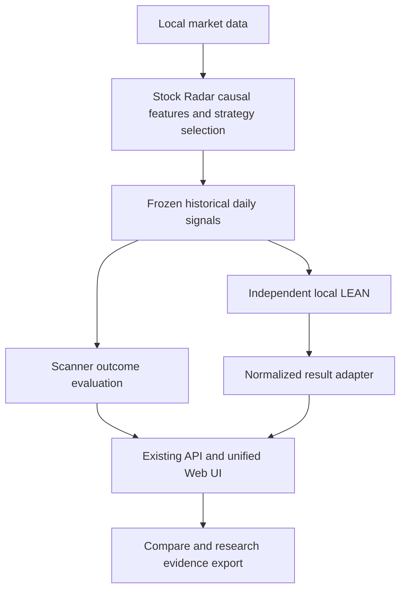

> **2026-10-08 research-direction supersession:** This document remains a dated engineering/development snapshot. It is no longer the current source for research direction. For active work, use the [canonical ledger](../journey-2026-09-30-0651-📌当前总账.md) and [Quant + Vision Fusion direction](quant-vision-fusion-direction-2026-10-08.md).

# Stock Radar 开发阶段报告 · 2026-10-06

> **2026-10-07（Asia/Shanghai）数据库专项增补：** 已实现并在本机生成开放历史快照 PIT master、独立身份边界特征库、按日 Scanner 接入及覆盖报告。最新完整本地测试为 **314 passed，1 warning**，包含原生 LEAN 回归。`CURRENT-P1-01/02/03` 已修复。真实历史证券身份、普通股分类与退市行情仍不完整，状态为 **reconstructed membership exploratory / source-dependent incomplete**；LEAN PIT 执行继续拒绝。详见 [PIT 验收报告](../acceptance/pit-acceptance-2026-10-07.md)。以下既有 LEAN 验收样本保留为历史证据。

> **类型：开发阶段快照 / 本地验收说明。** 当前任务状态和优先级仍以[当前总账](../journey-2026-09-30-0651-📌当前总账.md)为准；本报告不另建一份 backlog。
>
> **核对的代码基线：** `main @ 0dc8f3c22df75fe94d951f7ad1567a5093a837e4`。本次更新仅整理文档，不修改交易执行逻辑。
>
> **阶段结论：** 策略研究基础设施已可用；独立本地 LEAN 的第一版日线价格执行接入已通过工程验收。真实历史数据完整性、执行真实性和策略有效性仍需分别验证。

## 1. 当前项目定位

Stock Radar 是个人美股选股研究雷达。它将主观形态语言转成因果特征，从股票池过滤、评分、排序，保存历史候选，再检验这些候选是否富集了有利的后续走势。

正式组合回测交给免费开源 [QuantConnect LEAN](https://github.com/QuantConnect/Lean)。Stock Radar 不再继续扩展通用撮合和组合执行内核，也不会把 Strategy 2 或其他插件的选股判断重写进 LEAN。

| 层级 | 当前职责 | 边界 |
| --- | --- | --- |
| Stock Radar | 行情与研究数据、因果特征、策略插件、Scanner、选股、排名、候选质量评价、冻结信号 | 唯一的策略/选股逻辑来源；前瞻标签只属于评价层 |
| 独立本地 LEAN | 读取已冻结信号，模拟现金、仓位、订单、成交、成本和退出 | 通用执行算法不重新计算选股因子；不连接券商下单 |
| LeanResultAdapter | 核对原生结果，生成统一结果与指标来源 | 缺失或不适用指标保留 null；不伪造原生字段 |
| 原有 Web UI / API | 曲线、持仓、交易、活动、历史、Compare、审计和导出 | 前端不直接解析 QuantConnect 内部 JSON；保持一套网页 |
| Legacy 内核 | 历史兼容、golden case 验证 | 不是网页新回测选项，不作 LEAN 失败时的自动回退 |

## 2. 当前已经具备的能力

| 模块 | 已实现 | 当前范围或限制 |
| --- | --- | --- |
| 数据基础 | Alpaca SIP 日线、资产快照、来源约束、增量补缺、非破坏性校验、DuckDB | 当前资产快照不是完整历史股票池；没有自动 SIP 降级 |
| 因果研究 | As-Of 特征、未来变异回归检查、研究库 staging/原子提升、冻结切分 | 独立研究库必须单独构建；不随行情日更自动重建 |
| 策略插件 | Pluggy 注册、manifest/config、filter/score/select、精确版本、可信 ZIP 导入与卸载 | 日线候选插件，不是通用交易插件；检查不等于操作系统沙箱 |
| 历史 Scanner | 每个交易日候选排序、诊断分数、快照、前瞻标签与筛选漏斗 | 运行所选研究区间；尚无独立的一键最新交易日入口 |
| Scanner 评价 | 可配置 Top-K Precision/Lift、逐日与 pooled 指标、cooldown 事件 Precision/Lift、MFE/MAE、target-before-adverse、环境分层 | 这是前瞻结果评价；人工形态检索 Ground Truth 和概率校准仍未完成 |
| 正式 Backtest | 网页单阶段、顺序三阶段、Backtest 实验均使用原生 LEAN | 第一版支持 Current Snapshot 日线价格代理；PIT 执行明确拒绝 |
| 结果展示 | 权益与 SPY Benchmark、回撤、逐日现金/持仓、交易、订单接口、活动、审计 | 结果由统一 adapter 提供；不表示真实分钟撮合 |
| Run History / Compare | 查看、重命名、归档删除/恢复、曲线比较；旧结果明确标记 | 混合引擎 Compare 提示研究环境不同；不能默认视作同环境 |
| 实验 | Train/Validation 参数网格、阶段消融、固定参数 rolling walk-forward、Scanner strategy/evaluation namespace | 单次网格最多 64 变体；未完成完整的一等 Experiment 实体与报告生成 |
| 证据导出 | 选定 Scanner/Backtest Run、CSV/Parquet/JSON、指标、候选重叠、来源和 SHA-256 | 导出证据包已实现；自动撰写研究结论尚未实现 |
| 自动化 | Windows 静默行情更新、登录补跑、本地 API 启动、隐藏子进程 | 关机时不执行；下次登录并联网后补跑；不自动生成当日候选 |
| Fresh OOS | 数据具备足够冻结后交易日时提供入口 | 支持流程不等于已完成新鲜样本外策略验收 |

## 3. LEAN 迁移 Phase A–F 的完成范围

以下“完成”均限定在**第一版日线价格桥接**的范围内。

| 阶段 | 当前状态 | 验收含义 |
| --- | --- | --- |
| A · Signal export contract | 已完成 | `stock-radar-signals-v1`，固定日期/代码/rank/score/策略版本和因果执行上下文；拒绝前瞻标签、重复或非法记录 |
| B · 最小原生执行 adapter | 已完成 | 使用独立编译的 LEAN source launcher；读取冻结信号与价格；实际原生模拟组合 |
| C · Normalized result | 已完成 | `stock-radar-backtest-v1`；权益、现金、持仓、交易、订单、统计与原生结果核对 |
| D · 原有 UI 接入 | 已完成 | 原网页显示 native-derived 曲线、Benchmark、持仓、交易、审计、历史、Compare 与导出 |
| E · Golden-case parity | 初版对照已通过 | TP/SL、开盘跳空、最长持有、再入场、空信号、取消，以及逐笔/逐日现金权益；不是所有执行情景的穷尽证明 |
| F · 正式入口切换 | 已完成 | 网页新运行只接受 LEAN；显式 legacy 网页请求拒绝；旧内核限程序化兼容验证 |

### 安装与运行边界

- 独立安装：`D:\QuantConnect-LEAN`，不复制进 Stock Radar 仓库。
- 当前 LEAN 源码 commit：`82810ea63d5542f05dc58f9d1db0557cf174d0ea`。
- 使用独立 .NET SDK 10.0.401 和 Python 3.11.9 运行时构建/运行；这是本机安装信息，不是 Stock Radar Python 版本要求。
- 本机 Python shutdown 兼容补丁有单独记录；Run identity 保存能够获取的 LEAN commit、launcher/engine/Python 哈希和安装补丁哈希，因此 commit 本身不能完全代替 build identity。
- `config/lean.yaml` 提供默认路径、7200 秒超时和默认 30 个同时持仓上限；路径可由 `STOCK_RADAR_LEAN_ROOT` 覆盖。每次 Run 记录有效设置。
- 调用免费编译源码 launcher，不需要付费 CLI、Docker 或云端回测账户。
- worker 和原生 child 在 Windows 隐藏控制台；取消和超时处理原生进程。输入准备阶段也检查取消。

### 输入封存和审计

每个 Run 在执行前保存固定信号、执行价格、manifest 和数据索引。RunStore 一次性绑定封存 manifest 哈希；运行前后核对 manifest、配置、算法、信号、价格导出、数据索引和实际消费文件。原生算法在初始化时核对 manifest/信号哈希。
