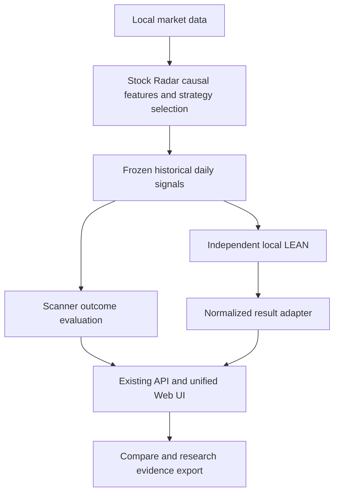

# Stock Radar 开发阶段报告 · 2026-10-06

> **2026-10-07（Asia/Shanghai）数据库专项增补：** 已实现并在本机生成开放历史快照 PIT master、独立身份边界特征库、按日 Scanner 接入及覆盖报告。最新完整本地测试为 **314 passed，1 warning**，包含原生 LEAN 回归。`CURRENT-P1-01/02/03` 已修复。真实历史证券身份、普通股分类与退市行情仍不完整，状态为 **reconstructed membership exploratory / source-dependent incomplete**；LEAN PIT 执行继续拒绝。详见 [PIT 验收报告](pit-acceptance-2026-10-07.md)。以下既有 LEAN 验收样本保留为历史证据。

> **类型：开发阶段快照 / 本地验收说明。** 当前任务状态和优先级仍以[当前总账](journey-2026-09-30-0651-📌当前总账.md)为准；本报告不另建一份 backlog。
>
> **核对的代码基线：** `main @ 0dc8f3c22df75fe94d951f7ad1567a5093a837e4`。本次更新仅整理文档，不修改交易执行逻辑。
>
> **阶段结论：** 策略研究基础设施已可用；独立本地 LEAN 的第一版日线价格执行接入已通过工程验收。真实历史数据完整性、执行真实性和策略有效性仍需分别验证。

## 1. 当前项目定位

Stock Radar 是个人美股选股研究雷达。它将主观形态语言转成因果特征，从股票池过滤、评分、排序，保存历史候选，再检验这些候选是否富集了有利的后续走势。

正式组合回测交给免费开源 [QuantConnect LEAN](https://github.com/QuantConnect/Lean)。Stock Radar 不再继续扩展通用撮合和组合执行内核，也不会把 Strategy 2 或其他插件的选股判断重写进 LEAN。

| 层级 | 当前职责 | 边界 |
| --- | --- | --- |
| Stock Radar | 行情与研究数据、因果特征、策略插件、Scanner、选股、排名、候选质量评价、冻结信号 | 唯一的策略/选股逻辑来源；前瞻标签只属于评价层 |
| 独立本地 LEAN | 读取已冻结信号，模拟现金、仓位、订单、成交、成本和退出 | 通用执行算法不重新计算选股因子；不连接券商下单 |
| LeanResultAdapter | 核对原生结果，生成统一结果与指标来源 | 缺失或不适用指标保留 null；不伪造原生字段 |
| 原有 Web UI / API | 曲线、持仓、交易、活动、历史、Compare、审计和导出 | 前端不直接解析 QuantConnect 内部 JSON；保持一套网页 |
| Legacy 内核 | 历史兼容、golden case 验证 | 不是网页新回测选项，不作 LEAN 失败时的自动回退 |

## 2. 当前已经具备的能力

| 模块 | 已实现 | 当前范围或限制 |
| --- | --- | --- |
| 数据基础 | Alpaca SIP 日线、资产快照、来源约束、增量补缺、非破坏性校验、DuckDB | 当前资产快照不是完整历史股票池；没有自动 SIP 降级 |
| 因果研究 | As-Of 特征、未来变异回归检查、研究库 staging/原子提升、冻结切分 | 独立研究库必须单独构建；不随行情日更自动重建 |
| 策略插件 | Pluggy 注册、manifest/config、filter/score/select、精确版本、可信 ZIP 导入与卸载 | 日线候选插件，不是通用交易插件；检查不等于操作系统沙箱 |
| 历史 Scanner | 每个交易日候选排序、诊断分数、快照、前瞻标签与筛选漏斗 | 运行所选研究区间；尚无独立的一键最新交易日入口 |
| Scanner 评价 | 可配置 Top-K Precision/Lift、逐日与 pooled 指标、cooldown 事件 Precision/Lift、MFE/MAE、target-before-adverse、环境分层 | 这是前瞻结果评价；人工形态检索 Ground Truth 和概率校准仍未完成 |
| 正式 Backtest | 网页单阶段、顺序三阶段、Backtest 实验均使用原生 LEAN | 第一版支持 Current Snapshot 日线价格代理；PIT 执行明确拒绝 |
| 结果展示 | 权益与 SPY Benchmark、回撤、逐日现金/持仓、交易、订单接口、活动、审计 | 结果由统一 adapter 提供；不表示真实分钟撮合 |
| Run History / Compare | 查看、重命名、归档删除/恢复、曲线比较；旧结果明确标记 | 混合引擎 Compare 提示研究环境不同；不能默认视作同环境 |
| 实验 | Train/Validation 参数网格、阶段消融、固定参数 rolling walk-forward、Scanner strategy/evaluation namespace | 单次网格最多 64 变体；未完成完整的一等 Experiment 实体与报告生成 |
| 证据导出 | 选定 Scanner/Backtest Run、CSV/Parquet/JSON、指标、候选重叠、来源和 SHA-256 | 导出证据包已实现；自动撰写研究结论尚未实现 |
| 自动化 | Windows 静默行情更新、登录补跑、本地 API 启动、隐藏子进程 | 关机时不执行；下次登录并联网后补跑；不自动生成当日候选 |
| Fresh OOS | 数据具备足够冻结后交易日时提供入口 | 支持流程不等于已完成新鲜样本外策略验收 |

## 3. LEAN 迁移 Phase A–F 的完成范围

以下“完成”均限定在**第一版日线价格桥接**的范围内。

| 阶段 | 当前状态 | 验收含义 |
| --- | --- | --- |
| A · Signal export contract | 已完成 | `stock-radar-signals-v1`，固定日期/代码/rank/score/策略版本和因果执行上下文；拒绝前瞻标签、重复或非法记录 |
| B · 最小原生执行 adapter | 已完成 | 使用独立编译的 LEAN source launcher；读取冻结信号与价格；实际原生模拟组合 |
| C · Normalized result | 已完成 | `stock-radar-backtest-v1`；权益、现金、持仓、交易、订单、统计与原生结果核对 |
| D · 原有 UI 接入 | 已完成 | 原网页显示 native-derived 曲线、Benchmark、持仓、交易、审计、历史、Compare 与导出 |
| E · Golden-case parity | 初版对照已通过 | TP/SL、开盘跳空、最长持有、再入场、空信号、取消，以及逐笔/逐日现金权益；不是所有执行情景的穷尽证明 |
| F · 正式入口切换 | 已完成 | 网页新运行只接受 LEAN；显式 legacy 网页请求拒绝；旧内核限程序化兼容验证 |

### 安装与运行边界

- 独立安装：`D:\QuantConnect-LEAN`，不复制进 Stock Radar 仓库。
- 当前 LEAN 源码 commit：`82810ea63d5542f05dc58f9d1db0557cf174d0ea`。
- 使用独立 .NET SDK 10.0.401 和 Python 3.11.9 运行时构建/运行；这是本机安装信息，不是 Stock Radar Python 版本要求。
- 本机 Python shutdown 兼容补丁有单独记录；Run identity 保存能够获取的 LEAN commit、launcher/engine/Python 哈希和安装补丁哈希，因此 commit 本身不能完全代替 build identity。
- `config/lean.yaml` 提供默认路径、7200 秒超时和默认 30 个同时持仓上限；路径可由 `STOCK_RADAR_LEAN_ROOT` 覆盖。每次 Run 记录有效设置。
- 调用免费编译源码 launcher，不需要付费 CLI、Docker 或云端回测账户。
- worker 和原生 child 在 Windows 隐藏控制台；取消和超时处理原生进程。输入准备阶段也检查取消。

### 输入封存和审计

每个 Run 在执行前保存固定信号、执行价格、manifest 和数据索引。RunStore 一次性绑定封存 manifest 哈希；运行前后核对 manifest、配置、算法、信号、价格导出、数据索引和实际消费文件。原生算法在初始化时核对 manifest/信号哈希。

这些检查保证已封存执行输入不会静默漂移。2026-10-07 增补已另外修复 `CURRENT-P1-02`：消费 Scanner 的 Backtest 保存信号生产时的完整 provenance，并拒绝同 ID/版本下策略、adapter 或相关宿主实现不匹配的来源。

结果显式保存 `engine=lean`、策略 ID/版本、信号来源与快照、数据快照、时间边界、初始资金、有效执行配置和 engine/build identity。旧 Run 标记 `engine=legacy`；指标标明来自原生 LEAN 还是独立展示分析层。

## 4. 当前验收证据

### 4.1 测试

- 2026-10-06 完整原生测试在内的 pytest：**272 passed，1 warning**；警告为既有 `websockets.legacy` 弃用提示。
- 最后输入准备取消处理调整后，worker/store 定向验证：**15 passed**。
- 原生测试需 `STOCK_RADAR_TEST_LEAN=1` 与本机独立安装；不启用时跳过安装相关测试。
- 本次 README/报告更新没有修改执行代码，不另行声称重新跑过完整测试。这些数字是该代码基线的既有本地验收记录，不是新的 GitHub hosted CI 结果。

原生 golden case 使用相同候选、日期、初始资金、仓位、费用、滑点和退出规则，与 legacy validator 核对入场/出场日期、价格、股数、费用、盈亏及每一天的现金和权益，数值容差 `1e-4`。另外覆盖空信号、原生子进程取消、封存文件篡改、故意污染原生最终权益的拒绝行为。

原生 exit reason 使用简短标签，省略旧标签 `_signal_next_open` 后缀；此文本差异与成交时点分别核对，不能将字符串不同误认为交易逻辑不同。

### 4.2 真实 Scanner → 原生 LEAN smoke test

| 项目 | 验收样本 |
| --- | --- |
| 策略 | `bottom_base_green_candle_v1`，版本 `1.0.0` |
| 区间 | Validation，2024-09-30 至 2025-09-22 |
| 来源 Scanner | `1eed6775-9d24-47c9-a5ef-d00d1641c7ec` |
| 原生 LEAN Run | `83489190-ce36-428a-ac9c-fbaf97a850cd` |
| 执行规模 | 245 个交易日，96 笔已平仓交易，结束时 7 个未平仓持仓 |
| 核对 | 原生最终权益、费用和订单与 adapter 核对；保留未平仓持仓，不强制收尾平仓 |

这证明端到端接入能够消费实际研究快照并形成可展示结果；不证明该策略有可交易优势，也不是新鲜样本外结果。完整资金数字、详细交易和原生 JSON 保存在被忽略的本地 `data/`，本报告只公开工程验收摘要。

### 4.3 浏览器验收

桌面浏览器实际查看了同一 Web UI 中的 portfolio/SPY 两条曲线、回撤、持仓、交易、信号与引擎审计；未观察到控制台错误。混合 LEAN/legacy Compare 显示四条比较曲线及不同执行环境警告。本地截图留在 `data/strategy-lab/lean-validation/`，未作为本次文档发布内容上传。

## 5. 回测真实度的当前假设

1. **只有日线输入。** 给 LEAN 的 minute-format 文件是两次平坦价格代理：09:31 ET 才可见日线 Open，交易所收盘才可见 Close，包含提前收盘日。它不是实际分钟行情，日线 Open 也不声称是真实 09:31 报价。
2. **信号与成交分离。** 收盘后固定信号，后续交易日开盘执行；close-based TP/SL/最长持有条件在后续开盘退出。开盘跳空退出先于新入场。TP/SL 基础包含入场费用。
3. **结算与成交简化。** 使用 LEAN ImmediateFillModel、ConstantSlippageModel 和配置费率模型；现金支持、杠杆 1、即时结算。没有真实 T+1 可用资金限制、订单簿、部分成交或日内触发先后。
4. **仓位限制显式记录。** 使用仓位比例、最低比例、ADV 上限、每天新增上限与同时持仓上限；触及数量上限后对选定权重归一。结束时不强制平仓。
5. **保持输入价格基础。** 来源为供应商拆股调整日线；LEAN 使用 Raw normalization 和 identity map/factor，不额外杜撰分红、拆股或退市支付。价格序列精度为 USD 0.0001。
6. **数据偏差仍在。** 当前资产快照有幸存者偏差，eligible universe 也不严格等于普通股。2026-10-07 已增加开放 Git 快照历史 master builder 和本地数据，但无法认证完整证券身份、普通股与退市覆盖；LEAN PIT 终止事件/公司行动执行在通过验证前明确拒绝。
7. **费用不是实盘合同。** 当前示例费率仍未确认。不同成本、流动性和成交假设必须显式纳入研究环境，不能仅凭引擎成熟就认定结果等于实盘。
8. **已看过的 Test 属于探索。** 历史 Test 不能重复命名为 Fresh OOS；需要冻结策略后新到来的足够交易日和成熟标签才能建立新的评价证据。

## 6. 当前使用方法

### 启动一套本地网页

双击仓库根目录 `启动本地看板.cmd`：打开 `http://127.0.0.1:4174/lab.html#scanner`。

| 服务 | 作用 |
| --- | --- |
| `127.0.0.1:4174` | 唯一维护的网页，来源 `site/dist/` |
| `127.0.0.1:8765` | 同一产品的本地数据/研究 API |

两端口属于前端和后端，不是两套网页。Streamlit 已退出维护。Sites 是可选发布副本，只有明确的大版本发布请求才更新；本次不部署 Sites。

### 策略研究与回测

1. 编写或导入可信策略插件，选择精确版本；规则见[插件规范](../docs/STRATEGY_PLUGIN_SPEC.md)和[参数契约](../docs/RESEARCH_PARAMETER_CONTRACT.md)。
2. Scanner Research 在所选历史区间生成逐日候选和评价；未来标签不进入策略输入或 LEAN 信号。
3. Backtest 选择阶段与有效执行参数，读取匹配 Scanner 快照或由 Stock Radar 生成历史信号，再冻结后调用 LEAN。
4. 原生每日组合观测进入现有时间线，完成后 adapter 核对并发布统一结果。三阶段顺序执行，每阶段资金和持仓重新初始化；不是跨三个样本段连续持仓的账户。
5. 查看曲线、持仓、交易、活动、审计、历史与 Compare；需要保留研究证据时使用 Export Bundle。显示暂停只改变展示，不改变已经执行的账务。

### 行情日更与研究库

`StockRadar-DailyUpdate` 计划任务更新行情库并校验，使用 `pythonw.exe` 静默运行，支持下次登录补跑。电脑关机时无法运行任务；联网恢复后才可访问 Alpaca。

**当前日更不会自动将新行情合并至研究库。** `data/market.duckdb` 和 `data/phase2-research.duckdb` 是两个边界：后者包含独立构建的特征/标签/切分。研究构建使用 staging、完整性检查、原子提升和默认保留三个备份。`scripts/build_research.py` 面向已准备好的研究源库，不能被当作从 market 库同步原始日线的命令。

因此，“行情下载成功”“研究库已刷新”“今天候选已生成”是三个独立状态。最后一项的一键产品入口尚未完成，本报告不把历史快照浏览描述为每日实盘选股服务。

## 7. 尚未完成的事项与下一阶段

### 正确性：沿用当前总账，不因迁移引擎而销项

| 优先级 | 项目 | 当前状态 |
| --- | --- | --- |
| P1 | Scanner 自定义标签 horizon 不能越过冻结 split 评价边界 | DONE 2026-10-07；队列/worker 验证及价格/交易日读取物理截断 |
| P1 | 来源 Scanner 当时的策略实现，与消费 Run 的溯源完整绑定 | DONE 2026-10-07；保存来源 provenance 并拒绝实现不匹配 |
| P1 | 批量实验上下文在创建过程中始终属于同一研究快照 | DONE 2026-10-07；捕获共享快照，提交前复核，变更时零入队 |
| P2 | 全部服务路径强制精确版本，旧 bare-ID 路径隔离 | OPEN |
| P2 | 调度调用合并、减少重复系统进程扫描 | OPEN |
| P2 | 所有结果选择面统一显露精确版本 | OPEN |
| P3 | 后台刷新不清除重要消息；Fresh OOS 可用性动态刷新 | OPEN |

以上 P1 状态由 2026-10-07 数据库专项代码及回归更新；P2/P3 继续沿用当前总账。

### 产品和研究里程碑

建议保持当前总账顺序：先解决研究正确性，再做独立 latest-session Daily Scanner，让研究库更新、扫描时点、版本和数据快照状态可见。随后完善 Scanner-centric Compare 和小范围 UI 整理。

后续原生执行验证应针对可信 PIT 数据、公司行动/退市、真实结算和更多执行边界逐项建立可解释对照，再考虑实际分钟输入。人工图形标注、概率校准、Quant/Vision/Fusion、历史盘前/期货上下文、GPT 二筛与自动研究报告仍是后续目标，不能从路线图直接认定为现有功能。

第一版 LEAN 工程验收已经完成，不需要为了这些目标恢复自研通用执行内核。新功能优先复用成熟开源组件，并保留来源和许可说明。

## 8. GitHub、归档与本地数据的关系

- GitHub `main` 是代码、网页、配置模板与文档的同步基准。
- [旧版网页标签](https://github.com/zhoushuming073-cell/stock-radar/tree/legacy-backtest-ui-2026-10-06)保留 LEAN-only 切换前的版本；新网页没有旧回测入口。
- 旧 Run 不删除，保留 engine identity 和历史展示；旧 Phase 2 收益与 1,231 个 signal dates 的插件迁移证据都属于 legacy，不等于本次 LEAN parity。
- 本机 `data/` 保存市场库、研究库、SQLite RunStore、LEAN 原始/统一结果与生成导出；`.env` 和密钥不上传。
- `D:\QuantConnect-LEAN` 保持独立安装；本仓库只提交接入代码、配置模板、契约、测试和说明。
- 2026-10-06 发布范围仅文档；2026-10-07 增补包含 PIT importer/adapter、正确性修复、测试和汇总文档。原始历史快照、大型数据库、逐股票导出及凭据不上传。

## 9. 进一步阅读

- [English README](../README.md) / [中文 README](../README.zh-CN.md)
- [当前总账](journey-2026-09-30-0651-📌当前总账.md)
- [LEAN execution contract](../docs/LEAN_EXECUTION.md)
- [Research Export Bundle](../docs/research-export.md)
- [PIT Security Master 输入与限制](../docs/PIT_SECURITY_MASTER.md)
- [项目方向反思：雷达优先](personal-research/research-2026-09-30-1246-stock-radar-product-boundary-final.md)

**当前可交付的是一套可研究、可保存证据、可调用独立 LEAN 并在原网页查看结果的本地系统。下一阶段的价值在于候选质量和研究可信度，而不是继续增加自研交易引擎功能。**
