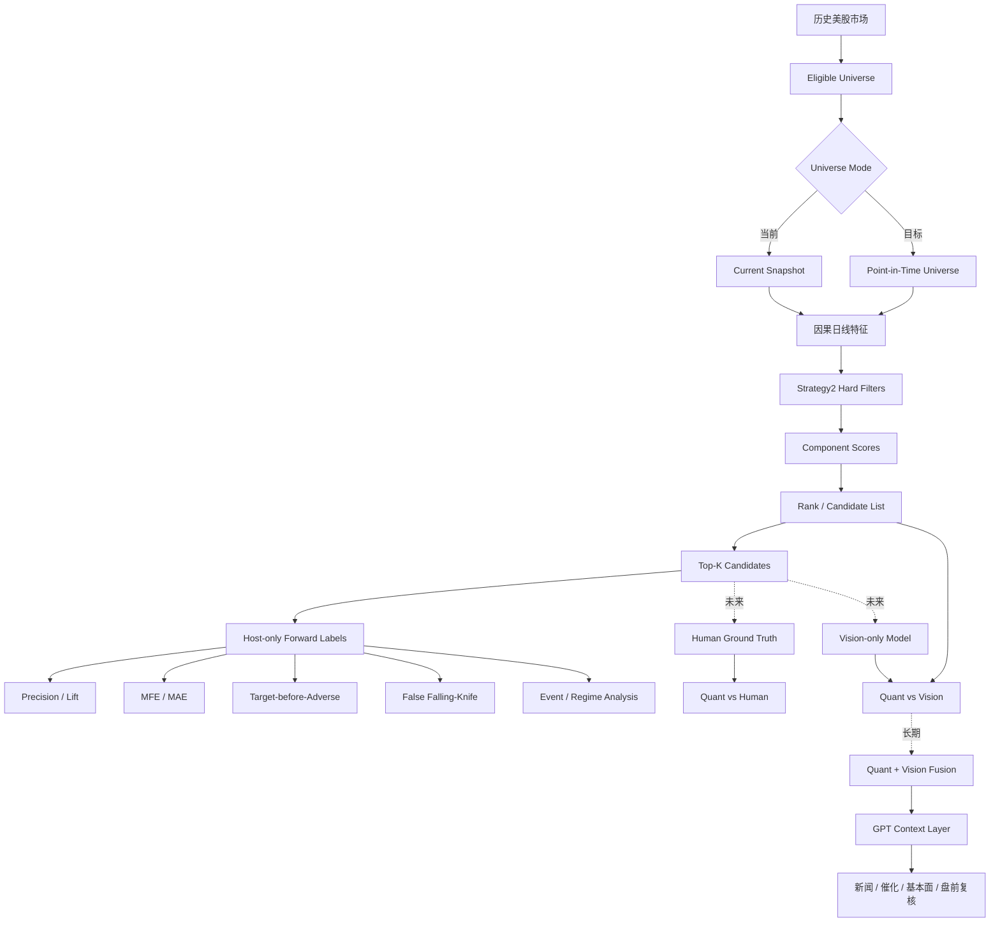
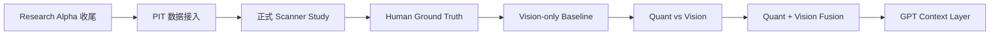

# Stock Radar 项目阶段性研究报告

> 历史阶段报告。项目当前状态以 `reports/README.md` 指向的总账为准。

**报告日期：2026 年 9 月 27 日**\
**研究阶段：Research Alpha / Experimental Ready**\
**代码基线：当前 GitHub `main`，核心重构快照 `f1d992f`**\
**Universe 状态：`Current Snapshot`，存在幸存者偏差风险**\
**报告性质：项目阶段性技术与研究方法报告，不构成策略有效性证明**

## 执行摘要

Stock Radar 的目标已经从“做一个通用回测平台”逐步收敛为一个**个人量化选股雷达与价格形态研究系统**：将“前期强势、充分回撤、下跌衰竭、出现承接、初步转强但尚未明显扩张”等主观盘感拆解为因果、可记录、可复现的量化特征，先从全市场筛出少量候选，再用统一的未来窗口评价其 Precision、Lift、MFE、MAE、Target-before-Adverse 等结果，未来进一步比较 **Quant、Vision、Quant+Vision Fusion**，并在最终阶段叠加新闻、催化剂、基本面与盘前信息。项目当前已经具备日线数据基础、Strategy2、插件框架、Scanner、Backtest、Run 持久化、`ResolvedRunConfig`、Filter Funnel、Forward Labels v2 与 PIT Universe 接口；研究参数已明确分为 `strategy / evaluation / execution / dataset / view`。fileciteturn5file0L2-L2 fileciteturn4file0L2-L2

但必须明确：**当前尚未提供本地 `runs.sqlite3` 的具体 Run 数据，也尚未接入真实历史 PIT Security Master，因此本报告不声明 Strategy2 已经具有稳定预测优势。所有历史研究应暂按 `Current Snapshot` 理解，并标记 `Survivorship Bias Risk: Present`。** 仓库已经实现 PIT 数据接口、稳定 `security_id`、ticker mapping、上市/退市区间、coverage 与 fingerprint 检验，但官方项目文档明确说明真实 PIT 数据并未随仓库提供，而且仅有 Security Master 仍不够，退市股票的历史价格、特征和公司行动数据也必须完整。fileciteturn16file0L2-L2

**结论性要点**

- 当前系统已经具备进行**探索性 Scanner 实验**的基础条件，但尚未达到“无偏历史验证完成”的标准。fileciteturn5file0L2-L2
- 项目研究重点应继续从 Portfolio Return 转向 **Candidate Quality、Enrichment 与可解释性**。fileciteturn12file0L2-L2
- 当前最大外部瓶颈已经不是策略代码，而是 **PIT Universe + 退市股历史数据 + 新鲜 OOS 数据**。fileciteturn16file0L2-L2
- Quant 主线已经进入可实验阶段；Vision 与 Fusion 应作为后续独立研究分支，而不是替代现有 Quant 基线。fileciteturn5file0L2-L2

**可执行建议：**先完成 Scanner 统计、UI 和 Experiment 的最后一轮收尾，然后立即开始第一轮 Train/Validation 实验；同时并行接入 PIT 数据，不再进行大规模底层重构。

## 项目定位与研究流程

**项目背景与研究动机**

Stock Radar 要解决的核心问题不是“怎样找到历史收益最高的参数”，而是一个更基础、更可证伪的问题：

> **主观的价格形态判断，能否被机器表示，并且这些表示是否真的提高未来有利结果的条件概率？**

当前 Strategy2 所表达的原始交易直觉可以概括为：

> 前期有强势基础 → 经历较充分的回撤 → 下跌速度开始衰减 → 下方出现拒跌或承接 → 不再持续创新低 → 出现初步反转迹象 → 但尚未过度拉升。

项目 README 已明确把研究方向从历史权益曲线最大化转向 pattern quantification，并计划形成 Quant、Vision、Fusion 和 candidate-only intraday 四条研究线。fileciteturn5file0L2-L2

**明确目标与非目标**

| 类型 | 内容 |
|---|---|
| 核心目标 | 将主观形态语言转成因果量化特征 |
| 核心目标 | 从美股大股票池筛选少量每日候选 |
| 核心目标 | 用固定未来窗口评估候选是否相对市场显著富集 |
| 核心目标 | 保留每次 Run 的代码、数据、参数与来源，实现可复现研究 |
| 中期目标 | 人工 Ground Truth、概率模型、Vision-only、Quant/Vision Fusion |
| 长期目标 | GPT 辅助新闻、催化剂、基本面、盘前信息二次筛选 |
| 非目标 | 当前不做自动券商下单与无人值守实盘交易 |
| 非目标 | 当前不追求高频或全市场分钟级数据平台 |
| 非目标 | 不把单次历史 CAGR 或 Test 结果视为策略有效性证明 |

仓库明确说明当前没有 broker-order path，且过去已经查看过的 Test slice 只能视为 exploratory，而不是新的 out-of-sample 证据。fileciteturn5file0L2-L2

**整体研究流程**



这一流程意味着 **Scanner 是主要研究仪器，Backtest 是执行与组合层的辅助验证仪器**。Scanner 的职责是回答“候选是否优于基准”；Backtest 才回答“在具体仓位、滑点、止盈止损和资本约束下会发生什么”。当前参数架构已经把这两个问题拆开。fileciteturn4file0L2-L2

**结论性要点**

- 研究对象首先是“候选质量”，其次才是“组合收益”。
- Quant 与未来 Vision 必须使用相同未来标签，才能进行公平比较。
- GPT 更适合作为 Quant/Vision 之后的 Context Layer，而不是直接替代第一阶段筛选。
- 当前 Test 已经被查看，不应继续作为真正独立的模型选择依据。fileciteturn5file0L2-L2

**可执行建议：**第一份正式实验报告只回答 Strategy2 是否产生稳定 Lift，不先讨论机器学习或 Vision 是否更高级。

## 核心策略与技术架构

**Strategy2 核心思想**

当前实现中，Strategy2 使用七个主要生命周期评分组件，另外以 Elasticity 作为重要资格条件；总分权重仍有一部分写死在 `full_strategy2.py`。fileciteturn10file0L2-L2

| English | 中文 | 研究含义 | 当前主权重 |
|---|---|---|---:|
| Prior Strength | 前期强势 | 回撤前曾有足够上涨或强势基础 | 15% |
| Pullback Quality | 回撤质量 | 当前回撤深度是否接近理想范围 | 20% |
| Downside Exhaustion | 下跌衰竭 | 下跌速度、阴线实体和波动是否收缩 | 15% |
| Support / Absorption | 支撑 / 承接 | 下影、收盘位置、失败跌破、缩量等承接迹象 | 15% |
| New-Low Stop | 停止创新低 | 是否停止连续制造新低并出现更高低点 | 10% |
| Early Reversal | 初步转强 | 正收益、阳线、靠近高位收盘、重新站回短均线等 | 20% |
| Not Extended | 尚未过度扩张 | 防止已经反弹太远、单日涨太多或离 MA5 太远 | 5% |
| Elasticity | 弹性 | 对股票历史价格弹性进行前置过滤 | Hard Filter |

现有策略配置还暴露了最低 Elasticity、最低前期涨幅、8%–40% 回撤、创新低频率、最大反弹、最大单日涨幅、MA5 距离、收盘位置、下影比例和缩量等阈值；退出规则目前为 +5% take profit、-10% stop loss、最长 10 sessions，但这些属于 Execution，而不是候选定义本身。fileciteturn8file0L2-L2

值得注意的是，理想回撤中心约 18%、评分宽度约 22%，以及 `.15/.20/.15/.15/.10/.20/.05` 的主评分权重仍属于代码中的研究假设；它们尚未成为普通 Run 参数。fileciteturn4file0L2-L2

**技术架构**

| 层 | 主要组件 | 代码位置 | 当前状态 | 备注 |
|---|---|---|---|---|
| 数据采集 | Alpaca 日线、资产信息 | `src/radar/ingestion/` | ✅ | 日线主数据源 |
| 市场存储 | DuckDB | `src/radar/db.py` | ✅ | 研究 worker 只读 |
| 特征层 | 日线量化特征 | `src/radar/research/pipeline.py`、`features/` | ✅ | 带版本号 |
| Strategy | Strategy2 / Plugin v1 | `src/radar/strategy/`、`strategies/` | ✅ | 可审计、可消融 |
| Scanner | 候选、标签、指标 | `lab/scanner.py`、`scanner_worker.py` | ✅主体 | 当前核心研究流程 |
| Backtest | 模拟成交与组合 | `src/radar/backtest/` | ✅ | 次级验证层 |
| Run Config | 参数解析与哈希 | `lab/parameters.py` | ✅ | `ResolvedRunConfig` |
| PIT | 历史证券身份边界 | `lab/universe.py` | ✅接口 | ❌真实数据未接 |
| 持久化 | Run SQLite | `lab/store.py` | ✅ | `runs.sqlite3` 本地保存 |
| API | Loopback API | `local_api.py` | ✅ | 本机服务 |
| UI | Web + legacy Streamlit | `site/dist/`、`strategy_lab_ui.py` | ⚠️ | 正在收敛为单 Web UI |
| Experiments | Grid / Ablation / WF | `lab/experiments.py` | ⚠️ | 目前仍以 Backtest 为中心 |

Python 3.11+ 是基础运行环境，核心依赖包括 Alpaca、DuckDB、NumPy、pandas、PyArrow、Pydantic、pluggy 与 PyYAML；Streamlit/Plotly 当前仍作为可选可视化依赖存在。fileciteturn24file0L2-L2 当前 README 也仍同时描述 4174 Web 与 8502 Streamlit Strategy Lab，因此 UI 去重尚未彻底完成。fileciteturn5file0L2-L2

**结论性要点**

- Strategy2 已经从单一筛选规则发展成可解释的多阶段形态模型。
- 技术主体已具备 Data → Feature → Scanner → Label → Run Record 闭环。
- 最大技术债不再是“没有框架”，而是旧 Backtest/Streamlit 架构和新 Scanner 研究架构仍有少量重叠。
- Vision 尚未实现，但当前 Feature/Run/Evaluation 分层足以作为未来公平比较的基础。

**可执行建议：**固定 Strategy2 v1 作为第一轮 Quant baseline；暂不急于开放所有隐藏权重，否则会迅速增加过拟合自由度。

## 研究完整性、参数与评价体系

**因果性与可复现性设计**

当前最重要的设计原则，是把“可研究的假设”开放，把“研究完整性”继续锁死。项目参数合同明确规定插件只能获得日期截止的 causal context，不能访问 future OHLC、未来 labels、账户权益、数据库连接或 order/fill API；Forward Labels、成交、费用、滑点、记账、持久化与哈希由 Host 管理。fileciteturn21file0L2-L33

| 硬锁 | 含义 | 当前实现方式 |
|---|---|---|
| Data Integrity Lock | 防未来数据泄漏 | 插件只获得 signal date 当时可见特征；未来行情只在选股完成后由 Host 打标签 |
| I/O Lock | 防插件绕过研究边界 | 不把 DB connection、broker API、order/fill API 暴露给插件 |
| Accounting Lock | 防策略修改成交结果 | Host 统一处理 fills、fees、slippage、cash、positions |
| Reproducibility Lock | 防运行后输入静默变化 | 保存 config/source/data hashes；queued Run 发现 hash 改变即失败 |

需要注意：源代码 AST/结构检查并不是 OS 级安全沙箱，因此第三方 Python Plugin 仍必须只安装可信代码。fileciteturn4file0L2-L2

**参数系统与 Run 配置**

系统现已建立五个 namespace：

| Namespace | 回答的问题 |
|---|---|
| `strategy` | 谁应该成为候选？ |
| `evaluation` | 怎样判断候选质量？ |
| `execution` | 如果模拟交易，怎样执行？ |
| `dataset` | 用什么数据、时间段和 Universe？ |
| `view` | 页面怎么展示？ |

其中 `view` 不进入 research hash；真正影响研究结果的是前四个 namespace。最终值的解析顺序为：

```text
Host Default
    ↓
Strategy Default
    ↓
Run Override
    ↓
ResolvedRunConfig
```

每个 leaf 同时记录其来源：`host_default`、`strategy_default` 或 `run_override`。fileciteturn14file0L2-L2

一个典型的逻辑结构可表示为：

```yaml
strategy:
  min_elasticity: 76.2143
  min_prior_peak_gain: 0.1323
  min_pullback: 0.08
  max_pullback: 0.40
  selection:
    max_candidates: null

evaluation:
  entry_reference: next_session_open
  horizon_sessions: 10
  upside_targets: [0.03, 0.05, 0.08, 0.10]
  downside_targets: [-0.03, -0.05, -0.08, -0.10]
  primary_target: 0.05
  top_k_values: [5, 10, 20]
  success_rule: target_touch
  event_cooldown_sessions: 5
  false_falling_knife:
    enabled: true
    max_drawdown_threshold: -0.08

execution:
  initial_capital: 1000000
  max_new_positions_per_day: 3
  entry_gap:
    enabled: true
    min: -0.10
    max: 0.05
  sizing:
    method: equal_cash
    max_position_fraction: 0.3333
    min_position_fraction: 0.01
  liquidity:
    max_adv_participation: 0.02
  slippage_bps: 10
  market_guard:
    mode: none
  execution_timing: next_open
  exit:
    take_profit: 0.05
    stop_loss: -0.10
    max_holding_sessions: 10

dataset:
  split: validation
  universe_mode: current_snapshot
```

这些默认值与当前 `scanner.py`、Strategy2 YAML 和旧 Backtest 配置的迁移逻辑一致。fileciteturn12file0L2-L2 fileciteturn23file0L2-L2

**评价体系与关键指标**

| 指标 | 含义 | 当前计算口径 | 状态 |
|---|---|---|---|
| Precision@K | Top-K 中成功样本比例 | 按 signal day rank 筛 Top-K 后 pooled | ✅ |
| Lift@K | Top-K Precision / 市场 Base Rate | 同日 eligible background 为分母 | ✅ |
| Mean Daily Precision | 每日 Precision 再平均 | 每个 signal date 等权 | ✅ |
| Median Daily Precision | 每日 Precision 中位数 | 降低极端日影响 | ✅ |
| MFE | 最大有利波动 | next-open 起算、未来 horizon high | ✅ |
| MAE | 最大不利波动 | next-open 起算、未来 horizon low | ✅ |
| Time-to-Target | 第几 session 达到目标 | 对每个 upside target 记录 | ✅ |
| Downside Hit | 是否触及负向阈值 | -3/-5/-8/-10% 等 | ✅标签 |
| Target-before-Adverse | 上涨目标是否先于风险阈值 | 同日双触碰记 ambiguous | ✅ |
| False Falling-Knife | 信号后继续创新低并发生大回撤 | 默认 MAE ≤ -8% | ✅ |
| Unique Signal Events | cooldown 后独立事件数 | 同股票按 session 距离去重 | ✅计数 |
| Event-level Precision/Lift | 独立事件级指标 | 应仅统计 event 首次观察 | ❌ |
| Regime Breakdown | 不同市场状态下的表现 | 当前已有 SPY MA20 拆分 | ⚠️ |
| Brier / Log Loss | 概率预测质量 | 插件存在 `p_*` 时计算 | ✅框架 |

Scanner Forward Label v2 已实现 upside/downside、MFE/MAE、time-to-target、Target-before-Adverse、ambiguous same-session、False Falling-Knife，以及概率输出时的 Brier/log-loss/calibration bins。fileciteturn12file0L2-L2

目前仍有一个统计上的重要缺口：`event_cooldown_sessions` 已经产生 `signal_event` 和 `unique_signal_event_count`，但 Precision/Lift 本身仍主要使用 raw candidate observations，因此连续多日出现的同一股票仍会多次贡献指标。fileciteturn12file0L2-L2 另外，当前 regime breakdown 在 `scanner_worker.py` 中读取的是 `primary_target` 对应的普通 hit，而不是始终读取 `primary_outcome`；当 `success_rule=target_before_adverse` 时，两者会产生语义不一致。fileciteturn27file0L2-L2

**Filter Funnel 与可解释性**

| 阶段 | 含义 | 是否记录 |
|---|---|---|
| Eligible Universe | 当日输入股票池 | ✅ |
| Tradable | 满足基础可交易条件 | ✅ |
| Feature Complete | 必要特征完整 | ✅ |
| Elasticity | 弹性门槛 | ✅ |
| Prior Strength | 前期强度 | ✅ |
| Pullback | 回撤结构 | ✅ |
| Exhaustion | 下跌衰竭 | ✅ |
| Support / Absorption | 承接/支撑 | ✅ |
| New-Low Stop | 停止创新低 | ✅ |
| Early Reversal | 初步转强 | ✅ |
| Not Extended | 尚未扩张过度 | ✅ |
| Fund Filter | 基金/ETN 等过滤 | ✅ |
| Final Ranked Candidate | 最终候选 | ✅ |
| Near Miss | 被淘汰且接近通过的股票 | ✅ |

`scanner_worker.py` 已经逐日保存 Funnel，并额外保留 near-miss 各阶段 pass/fail 信息，因此系统已经能够回答“候选为什么通过”以及“接近候选为什么失败”。fileciteturn27file0L2-L2

**结论性要点**

- 参数系统的主要语义混乱已经得到结构性解决。
- Scanner 指标已经明显超过传统“胜率 + CAGR”评价方式。
- 当前最值得补的是 Event-level metrics，而不是继续增加几十个新指标。
- Funnel 使 Strategy2 从黑箱排名器变成可诊断研究对象。

**可执行建议：**正式实验前统一修复 Event Precision/Lift 与 Regime `primary_outcome`；之后冻结 Evaluation v1，避免边跑实验边不断改变标签定义。

## 幸存者偏差、PIT 与当前进度

**当前 PIT 支持**

Stock Radar 已经建立 `PointInTimeUniverseProvider` 边界，`LocalSecurityMaster` 要求稳定 `security_id`、历史 symbol mapping、listing/delisting 日期、exchange、security type 与 `eligible` 标志；还会验证区间重叠、coverage、fingerprint，并允许 ticker reuse 但禁止同日身份冲突。fileciteturn7file0L2-L2

需要导入的本地文件为：

```text
data/security-master.csv
data/security-master-manifest.json
```

Manifest 记录 provider、source version、coverage start/end 及 coverage completeness。当前仓库明确说明：**真实 PIT 数据或 vendor adapter 并未随项目提供。**fileciteturn16file0L2-L2

更关键的是：

> **Security Master 只能解决“当时谁存在”，不能自动解决“后来退市股票的行情在哪里”。**

正式 PIT 研究还必须让历史 OHLCV、Feature Pipeline 和 corporate-action-adjusted series 同样覆盖退市证券。项目文档对此已经明确提示。fileciteturn16file0L2-L2

因此本报告中的任何历史结果，在真实 PIT 数据接入前都应统一标记：

> **Universe: Current Snapshot**\
> **Survivorship Bias Risk: Present**

**推荐 PIT 数据源**

| 优先级 | 数据源 | 适合 Stock Radar 的原因 | 主要注意事项 |
|---|---|---|---|
| 优先评估 | Norgate Data | US listed + delisted、稳定 `assetid`、本地/Python 研究友好 | 当前 Stock Radar 的 dated symbol mapping 可能需要专门 adapter |
| 第二评估 | QuantConnect + AlgoSeek | Security Master 有 symbol changes / delistings；AlgoSeek US Equities 明确为 survivorship-bias-free | 需确认本地化使用、许可及与现有 DuckDB 的集成方式 |
| 研究级备选 | CRSP | active + inactive securities、PERMNO/PERMCO 永久 ID，长期学术研究标准数据 | 集成和授权体系更偏专业研究机构 |

Norgate 官方资料称其 US listed/delisted 数据自 1992 年末起基本完整，并提供不会随 ticker、交易所、OTC 转换或退市改变的 `assetid`；其历史 index constituent 也可以按交易日查询。citeturn2view0 QuantConnect 的 Security Master 提供历史 symbol-change 和 delisting events，而 AlgoSeek US Equities 文档明确描述其自 1998 年起为 survivorship-bias-free，并依赖 Security Master 处理 splits、dividends 和 symbol changes。citeturn3view0turn3view2 CRSP 当前官方资料显示其 US Stock Databases 包含超过 36,000 个 active/inactive securities，并通过 PERMNO/PERMCO 提供永久身份。citeturn3view3turn3view4

**当前进度**

| 模块 | 状态 | 阶段判断 |
|---|---|---|
| Asset Master / 日线数据 | ✅ | 可用 |
| DuckDB / provenance | ✅ | 可用 |
| Feature Pipeline | ✅ | 可用 |
| Strategy2 v1 | ✅ | 可实验 |
| Plugin Interface v1 | ✅ | 可用 |
| Scanner Candidate Store | ✅ | 可用 |
| Forward Labels v2 | ✅ | 主体完成 |
| Precision / Lift / MFE / MAE | ✅ | 可用 |
| Daily Precision | ✅ | 可用 |
| Event 独立样本计数 | ✅ | 可用 |
| Event-level Precision/Lift | ❌ | 待补 |
| Filter Funnel / Near Miss | ✅ | 可用 |
| ResolvedRunConfig | ✅ | 可用 |
| Scanner → Backtest provenance | ✅ | 已有连接 |
| PIT Provider | ✅接口 | 数据未接 |
| 真实 PIT Security Master | ❌ | 当前 blocker |
| Delisted OHLCV / Features | ❌未证明完整 | 当前 blocker |
| Experiment Grid / Ablation / WF | ⚠️ | 仍偏 Backtest |
| 单一 Web UI | ⚠️ | 静态 Web 与 Streamlit 尚共存 |
| Human Ground Truth | ❌ | 后续阶段 |
| Vision-only | ❌ | 未来研究 |
| Quant/Vision Fusion | ❌ | 未来研究 |
| Fresh untouched OOS | ❌ | 正式结论前必需 |

现有 Experiments 模块明确使用 authoritative backtest worker，其 summary 仍围绕 total return 与 max drawdown，因此 Scanner evaluation 参数的系统化实验尚未成为该模块的一等公民。fileciteturn28file0L2-L2 本地 `runs.sqlite3` 被保存在 `data/strategy-lab/`，研究数据库与详细结果均留在本机而不是 GitHub，所以本报告无法读取你的真实 Run 指标。fileciteturn19file0L1-L14

**结论性要点**

- PIT **架构已经实现，数据问题尚未解决**。
- 第一轮方法学实验可以使用 Current Snapshot，但不能据此发表无偏历史结论。
- 真正的 PIT 完成条件是 Security Master + delisted OHLCV + Feature coverage，而不是只导入一张股票名单。
- Norgate、QuantConnect/AlgoSeek、CRSP 都是可行路线，但需要针对 Stock Radar 当前 identity schema 做真实 adapter 评估。

**可执行建议：**首先制作 Norgate 和 QuantConnect 的小样本 proof-of-concept，以“ticker change + delisting + historical membership + OHLCV coverage”四项验收，避免先购买或迁移大量数据再发现接口模型不匹配。

## 主要限制与下一阶段计划

**主要限制与风险**

| 优先级 | 风险 | 对研究的影响 | 当前处理 |
|---|---|---|---|
| 🔴 | Current Snapshot | 幸存者偏差，Base Rate/Lift 可能失真 | PIT 接口已有，真实数据缺失 |
| 🔴 | Fresh OOS 缺失 | 反复查看 Test 会形成隐性过拟合 | 需要未来独立时间段 |
| 🔴 | Delisted price/features 缺失 | 即使有 Security Master 仍可能漏样本 | 尚待数据源解决 |
| 🟠 | Event metrics 不完整 | 同股票连续信号可能放大样本量 | 已有 event flag，未用于 Precision/Lift |
| 🟠 | Regime outcome 语义 bug | TBA 模式下 regime 与总指标不一致 | 待修 |
| 🟠 | Experiments 偏 Backtest | 不利于直接优化 Scanner candidate quality | 待重构 |
| 🟠 | UI 双轨 | Web/Streamlit 容易产生参数与功能分叉 | 建议退役 8502 Lab |
| 🟡 | Strategy2 隐藏权重 | 权重研究需要改代码版本 | 当前固定反而降低自由度 |
| 🟡 | Security type 定义 | ETF/ADR/Preferred 等可能影响 Base Rate | PIT 后需正式 universe taxonomy |
| 🟡 | 日线 OHLC 路径 | 同日同时碰止盈/止损无法判断先后 | Scanner 已标 ambiguous |
| 🟡 | Plugin 非 OS sandbox | 不可信插件仍存在安全风险 | 仅安装可信插件 |
| 🟡 | 费用/退市结算 | 影响组合层净收益精度 | 不影响第一阶段 Scanner |

当前 GitHub commit status 没有挂载实际 CI status checks，因此在进入大量实验前，仍应以一次完整本地 `pytest` 和端到端 Scanner smoke run 作为发布门槛。fileciteturn22file0L1-L12

**下一阶段计划与验收标准**

由于项目工作必须以实际完成结果为准，以下使用**相对工程量**而不是承诺未来完成时间。

| 阶段 | 核心任务 | 工程量 | 验收标准 |
|---|---|---:|---|
| Research Alpha 收尾 | Event Precision/Lift、Regime bug、Scanner Experiments、UI 去重、完整测试 | M | Train/Validation Scanner 可稳定运行；单一正式 Lab UI；所有结果有 resolved config |
| PIT Data Integration | 选择供应商、写 adapter、导入 Security Master、补 delisted bars/features | L–XL | 任意历史日能恢复当日 universe；ticker change/退市案例通过；全区间 coverage 无空洞 |
| Formal Scanner Study | 冻结 Strategy2/Evaluation，跑 Train → Validation | M | 输出 Precision/Lift、Event metrics、MFE/MAE、Regime、Funnel；不使用 Test 调参 |
| Human Ground Truth | 隐藏未来的历史 K 线人工打分 | M | Quant Score 与人工 setup score 可比较 |
| Vision Baseline | 标准化 candlestick + volume 图片，只看过去 | L | 完成无未来泄漏的 Vision-only 指标 |
| Quant vs Vision | 相同 universe、split、labels 下公平比较 | M | Quant-only / Vision-only / Agreement 三组报告 |
| Fusion / Context | Quant+Vision，再叠加 GPT context | L | 证明增量价值，而不是只看绝对命中率 |



建议的研究门槛是：

**第一道门：Quant 有没有信号？**

```text
Train 有 Lift
        ↓
Validation 仍有 Lift
        ↓
Observation 与 Event 结论一致
        ↓
MAE / False Knife 可接受
        ↓
Regime 下不过度依赖单一环境
```

只有上述结果成立，才值得继续投入复杂模型。Vision 则应作为一个**独立表示假设**：

> 不告诉模型“回撤、承接、衰竭”是什么，只给它标准化的过去 K 线和成交量，观察它能否学习到相同或更多的信息。

最终比较应保持同一份 dataset、PIT universe、signal date、horizon 和 outcome definition，否则 Quant 与 Vision 的结果不可直接比较。

**结论性要点**

- 下一阶段不应继续大规模架构重写，而应开始产生真实实验数据。
- PIT 与 Fresh OOS 是从“探索研究”升级到“可信验证”的两个关键门槛。
- Human Ground Truth 是连接“你的盘感”与 Quant/Vision 模型的关键桥梁。
- Vision 的价值不是替代 Quant，而是检验手工特征是否遗漏视觉结构。

**可执行建议：**开发顺序固定为“Alpha 收尾 → 第一轮 Scanner 实验 → PIT → 正式历史验证 → Human/Vision”，避免同时开发五条路线而再次扩大系统复杂度。

## 附录：数据交付与图表建议

**为了把下一篇报告升级为真正的 Strategy2 实验报告，最小需要以下数据。**

| 优先级 | 文件 / 数据 | 用途 | 建议格式 |
|---|---|---|---|
| 必须 | `runs.sqlite3` | Run、metadata、metrics、candidates、artifact hashes | SQLite 原文件 |
| 必须 | Train Scanner Run | 第一阶段结果 | SQLite 内或 JSON export |
| 必须 | Validation Scanner Run | 样本外阶段比较 | SQLite 内或 JSON export |
| 必须 | `resolved_config` | 确认每次实验实际参数 | JSON |
| 必须 | Candidate records | Top-K、重复信号、案例分析 | SQLite / CSV / Parquet |
| 必须 | Metrics | Precision/Lift/MFE/MAE 等 | JSON |
| 必须 | Git commit / Strategy version | 可复现性 | 文本或 metadata |
| 强烈建议 | Funnel + Near Miss | 可解释性分析 | JSON / CSV |
| 强烈建议 | Market Regime metrics | 稳定性分析 | JSON |
| PIT 后必须 | `security-master.csv` | 历史证券身份 | CSV |
| PIT 后必须 | `security-master-manifest.json` | provider、coverage、fingerprint | JSON |
| PIT 后建议 | `phase2-research.duckdb` | 深入复查行情、features、labels | DuckDB |

项目目前已经规定 `runs.sqlite3` 存储 Run 配置与可复现元数据，而 PIT importer 使用 `security-master.csv` 与 `security-master-manifest.json`；因此这三项应成为未来研究报告的优先原始证据。fileciteturn19file0L1-L14 fileciteturn16file0L2-L2

不方便上传整个 DuckDB 时，最小交付包可以是：

```text
research-report-input/
├── run_train.json
├── run_validation.json
├── candidates_train.csv
├── candidates_validation.csv
├── funnel_train.json
├── funnel_validation.json
└── README.txt
```

其中两个 Run JSON 至少应包含：

```text
run_id
strategy_id
strategy_version
git_commit
resolved_config
resolved_config_hash
dataset split
signal_start / signal_end
evaluation_end
universe_mode
universe_provider
universe_fingerprint
survivorship_bias_risk
metrics
```

**建议正式实验报告加入以下图表：**

| 图表 | 回答的问题 |
|---|---|
| Precision@K / Lift@K 曲线 | 排名前部是否真正富集？ |
| Train vs Validation 对比 | 信号是否明显衰减？ |
| Observation vs Event Precision | 是否被重复信号虚增？ |
| MFE / MAE 分布 | 候选的收益空间与风险路径如何？ |
| Target-before-Adverse 矩阵 | 先涨后跌还是先跌后涨？ |
| Filter Funnel 瀑布图 | 哪一步过滤最强？ |
| Market Regime 热力图 | 信号是否只在牛市有效？ |
| Candidate Count 时间序列 | 信号密度是否集中在少数时期？ |
| PIT Coverage 时间线 | 历史 Universe 是否完整覆盖？ |
| Quant vs Human Score 散点图 | 机器是否找到了人真正想要的形态？ |
| Quant vs Vision Venn / Lift 对比 | 两类模型是在重复信息还是互补？ |

最终第一份**有真实 Run 数据支撑的正式实验报告**应优先回答三个问题：

> **Strategy2 的 Top-K 是否稳定高于同日市场 Base Rate？**\
> **这种 Lift 能否从 Train 延续至 Validation，并在 Event-level 仍然存在？**\
> **其优势是否来自大量独立信号，而非少数股票、少数行情阶段或幸存者偏差？**

在这些问题得到肯定答案以前，Stock Radar 最准确的定位仍是：

> **一个已经具备较完整研究基础设施、正在从主观选股经验迈向可验证 Quant/Vision 研究体系的个人量化股票雷达；当前可进行探索性实验，但基于 Current Snapshot 的历史结果仍必须明确标注幸存者偏差风险。**
